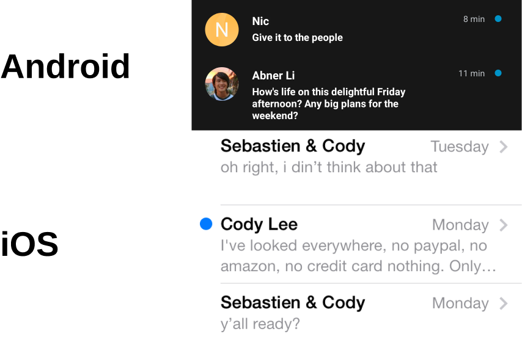

# Rapid Spin

*Hoo's Got It* is a lost-and-found app designed around trust. Intended for use in and around college campuses, where current solutions are either a network of chaotic bins or large group chats. High item availability in both solutions facilitates fraud and abuse. *Hoo's Got It* is purpose-built with features incompatible with being integrated into the current ad hoc solutions. A streamlined posting process makes listing a lost item as simple as sending a text. Then, a transparent claiming system, revealing the searches leading to the claim provides a digital analog to the physical process of providing identifying details to prove ownership. 

## Client

There is no client for this application. Instead, the users are Students in the University of Virginia community.

## Use Case

*Hoo's Got It's* design advantage is best explained through a use case:

> While closing up at a bar, Hunter finds an expensive Canada Goose jacket. Either from an innate desire to help others or the fact that his stature makes the jacket look as if he was a toddler, Hunter attempts to find the rightful owner. Hunter pulls out his phone, snaps a picture of the item, and taps a button indicating the item was found at his current location. 
> 
> The next morning, John is now terrified of losing such a valuable article of clothing. For some reason, John is incapable of exactly remembering where he left it (likely due to last night's events). So, John opens Hoo's Got It and searches for his item, providing as many details as possible: "Canada Goose Jacket, size medium with a hole in the left pocket and several gum wrappers in the right" and puts a pin near the corner, approximately where he left it. From the search, John sees a list of jackets and claims Hunter's posting, putting him in a direct messaging channel with Hunter.
> 
> After class, Hunter is notified that his item was claimed. However, the valuable jacket was claimed by multiple people: by John, who made his detailed (and accurate) query, and another user who simply searched for "jacket" and provided no approximate location nor identifying details.
> 
> From this information, Hunter quickly and confidently identifies John as the rightful owner. After arrangements are made, John gets his jacket back. All of this without Hunter revealing his name, nor his phone number. 

## Team Roles

- **Project manager:** Role distributed evenly between group members due to 4 person group
- **Research lead:** Caleb Adam
- **Design lead:** John Parzick 
- **Prototyping lead:** William Kaiser
- **Evaluation lead:** Hunter McGuire 
- **Reporting lead:** Distributed evenly between the group
 

## Figma Design File

<iframe style="border: 1px solid rgba(0, 0, 0, 0.1);" width="800" height="450" src="https://www.figma.com/embed?embed_host=share&url=https%3A%2F%2Fwww.figma.com%2Ffile%2FJ0YnOcrrUzx5PLPBOVWVOv%2FLost%252BFound%3Ftype%3Ddesign%26node-id%3D205%253A2%26t%3DzD6QxnLNvmHDkGxH-1" allowfullscreen></iframe>

## Interactive Prototype

<iframe style="border: 1px solid rgba(0, 0, 0, 0.1);" width="800" height="450" src="https://www.figma.com/embed?embed_host=share&url=https%3A%2F%2Fwww.figma.com%2Fproto%2FJ0YnOcrrUzx5PLPBOVWVOv%2FLost%252BFound%3Ftype%3Ddesign%26scaling%3Dscale-down%26page-id%3D205%253A2%26node-id%3D205-3%26starting-point-node-id%3D205%253A3" allowfullscreen></iframe>

## Logo Design Philosophy

From an objective standpoint, this logo is ugly.

However, due to Hoo's Got It's situation, the decision to create a visually jarring logo that conveyed the meaning of the app in user interviews were made. 

This change is in stark contrast to recent logo simplifications at major companies. However, deviation from this pattern is justified for increased recognizability, something a default for these companies given their scale.

### Intuitive Design Through Standardization

Through following existing design patterns, the site becomes more intuitive. 

A good example of this is the use of blue circles adjacent to profiles to indicate unread messages. This pattern can be seen in both iOS and Android among other messaging apps. 

### Island Structure of Claims

This also design pays homage to [prezi](https://prezi.com/)'s island structure. 

Though this design is fairly limited in the number of surrounding elements that can surround each item, because conflicts should be relatively rare, this was acceptable. 

Furthermore, a full-list view was introduced in the very rare occurrence that any more than four people attempted to claim the same item.

### Progressive Disclosure of Search Information

The search bar on the homepage is initially minimal, but after the user clicks, a map of where the location was lost is animated (a google maps styling from [SnazzyMaps](https://snazzymaps.com/style/72543/assassins-creed-iv).

## Information Design

When searching for your item, multiple ways of searching for your item are built in. 

A map view provides an at-a-glance look at where items were found, better for when you have a general idea of where something was lost. 

A list view takes inspiration from online shopping websites when displaying information. The user already knows which item they want, however, so the image could be smaller and more emphasis be placed on where and when this item was found.

## Page Design

This page was inspired by Instagram's profile page.

However, a deviation is made by showings items the user has claimed in the top right. Most apps would object to this design because claimed items do not scale elegantly. This becomes a feature of Hoo's Got It as it conveys to the user through the interface that they should not be claiming many more than one item at a time.

Listing how many items someone has returned provides social proof and satisfaction for returning items, intending to be intrinsically motivating.

## Research and Analysis

- There are limited solutions to this problem that have already been implemented/ marketed
 
 - This is likely due to a lack of ability to capture value for a business from a product like this as it is more of an informational exchange than a sellable product
 
- The pool for viable alternatives goes even further down when you consider this product in the context of the UVA community. It is intended to be used by students (or individuals with @virginia.edu emails) to enhance security and trustworthiness. 
 
 - At this time the only viable alternatives are as follows:
 
 - A UVA lost items GroupMe with over 1800 members, lacks organization or proper security precautions
 
 - A group chat like this while ineffective due to organizational issues is further hindered by network effects
 
 - For a service like this to work requires participation by a large portion of the UVA community unlike this GroupMe which contains less than 10% of the UVa student body
 
 - An app called Get it Back which is open to everyone and functions similarly to our concept but has few monthly users and poor reviews
 
 - It does not capture the essence of a local web-based lost-and-found with a heavy reliance on community engagement and outreach
 

## Lost and Found Group Chat

## The Value of Anonymity in Chats

- User interviews began by speaking with individuals in the UVA community who suffer from the problem of losing things (most students).
 
 - When interviewing, the biggest concern for individuals was not remembering where an item had been lost and security issues over their items
 
 - One interviewee asserted that having expensive items broadcasted on an app like this could cause some (less moral) people to use the app to steal expensive items
 

Interview Template.pdf

Interviews were conducted using the question set shown to the right. The following  each question were the major findings for each topic:

### History of Lost Items

- Have you ever lost something on UVa Grounds before? If yes, were you able to recover it?
 
 - "Yes, I have lost several items on UVa grounds.  Most recently, I lost a water bottle about a month ago.  I was not able to find it."
 
- If a day has passed since you realize an item has been lost, is it more difficult to find? If so, then explain.
 
 - "It is extremely difficult to find an item past one day.  Most of the time, especially if you lose it in a lecture hall or some large space, someone will come to collect and dispose of the item.  Also, you have to constantly retrace your steps around grounds, and that can be a very tedious task"

### Lost and Found at UVa 

- If you lost an item in Newcomb Hall, where would you start looking for the item?
 
 - "I would probably start looking in the last place I was in Newcomb Hall" 
 
 - (interviewee is then told that there is a lost and found located in Newcomb Hall)
 
 - "I didn't even know that.  I've never been to that lost and found area and have not tried to find any items there.  They honestly don't make it very clear where that is."
 
- Is the current lost and found system logically organized?
 
 - "I personally think that the current lost and found system is very unorganized.  Even just now I found out about the lost and found in Newcomb Hall, which I have no idea of and it's my third year here.  As for the other ones, most of them are just clutter-filled areas where if you see your item, you can take it.   Most of the time you have to be self-reliant when finding a lost item"
 
- If you lost a water bottle without knowing when, over the course of a day, how many places could this item probably be?
 
 - "I mean it could be anywhere.  There are so many places that I go to each day on grounds, I wouldn't know where to start.  I would probably walk through the rooms where I've had classes, but if I had no idea where I lost that water bottle, I would just consider it gone"
 

### Economic Value of Restitution

- If you lost a several-year old water bottle which initially retailed for $50, what is the maximum amount of time you would invest searching for it?
 
 - "I would probably search for it for a day.  If I couldn't find it by then, I would just have to get a new one.  You said it was several years old, so even though I would want to find it I would not be too distraught over it"
 
- If you lost an item which many would consider trivial, but gained sentimental value over time, how much time would you try and search for it?
 
 - "Since it has significant sentimental value to it, I would want to find it much more.  I would continuously search for it for probably a week or so, then I would consider it gone.  I would still really want the item back but wouldn't know what to do"
 

### Location-Based Interactions

- Have you heard of Yik Yak? Describe your experience with the platform
 
 - "Yes I've heard of Yik Yak.  I think it's a fun way to tell jokes and interact with people anonymously.  I don't use it that much anymore,  but last year I would be on it constantly"
 
- What are your thoughts on the potential for more location-based apps like Yik Yak on Grounds?
 
 - "I think location-based apps have their usefulness.  I just wouldn't want another app on my phone constantly tracking my location.  Sometimes it feels like an invasion of privacy but I guess that's just how things are nowadays.  So overall I wouldn't mind more location-based apps, as long as there are restrictions"
 
### Existing Solutions

- Have you heard of existing GroupMe or Facebook communities set up for lost items? If so, have you used them?
 
 - "I've heard of them but honestly I've never used or joined them.  I don't even fully understand how to find it or how the GroupMe for lost items works"
 
- What would be some of your pros and cons to using these kinds of groups?
 
 - "I think the pros are that it seems pretty direct.  People kind of report stuff out of the goodness of their hearts, so that's nice.   Also from what I've heard everyone is pretty truthful about their items.   The cons, for me, is accessibility.  I've never been in one of these groups and if you asked me to join right now, I wouldn't know how.  It almost feels like you have to get the link from  a friend or someone already in the GroupMe to join"
 

### Moral Value of Restitution

- If you returned an item to its owner, would this be a morally satisfying experience? If so, what amount of time investment seems reasonable to you?
 
 - "Yes I feel like it would be morally satisfying to me.  As for time, I would want the person to retrieve the item from me.  I found it after all, I wouldn't want to run around and try to schedule a time to meet the person"
 
### Trust

- How important is knowing you returned an item to the right person?
 
 - "I think that it is very important. I would feel bad if I gave it to someone else because it defeats the whole purpose of wanting to find a missing item"
 
- What steps would you take to verify ownership?
 
 - "Honestly, I don't know how many steps I would take.  I would at least make sure that item someone is looking for matches what I found.  Like if I found a blue jacket,  I wouldn't just give it to someone who said they lost a  jacket.  But I don't know how many steps I would take to verify ownership, that would be more on the person looking for it"
 
- What forms of additional information would make you more confident that someone is the true owner of an item?
 
 - "I would want to know if someone had anything that made their item unique.  So like if I found a water bottle and there was "A"  on the bottom, when I return it to the person I would expect them to know that their water bottle has that dent.  If they didn't, I would definitely be suspicious if that item is actually theirs"
 
- Would knowing how someone eventually claimed an item be useful to determine if they were the rightful owner?
 
 - "Yes I think it would be useful.  It would give me a little more reassurance that the item I'm returning actually belongs to the person" 
 
## Interaction Notes

Users were given the prototype to test and were told that they were initially someone who had found a water bottle and wanted someone to claim it. Then, users were told that they were in the position of someone who wanted to claim a water bottle that they had lost. Finally, users were told that they were again the poster of the lost item and had to find out the rightful owner.

Though the user interface is nuanced, displaying the two main points of interaction on the main screen provided a good jumping-off point for each interaction. Users were able to clearly identify the two main paths. Users had no trouble reaching any part of this screen due to the omission of touchable elements on the top part of the screen.

Users raised questions about how to modify the interface if someone is both a finder and a claimer at the same time.

The posting item-tracking interface was very familiar to users and some commented on the similarity to Instagram. This demonstrates the effectiveness of this form of visual parallels. 

Some people were a little confused as some posts were greyed out, not immediately understanding these to mean the posts were historical and the item had already been returned. This is likely only due to the fact that the user did not create those items initially. However, an additional modal for this screen should be tested.

To expand upon this design in the future, a modal popup will be best tested which will give the user an overview of the app upon installation to provide initial context. 

### Economic Considerations

We believe that the reason why an existing solution does not exist is mainly due to the economic considerations associated with this problem. 

Making enough money to cover costs is difficult for two reasons: the reliance on network effects within a university to facilitate the app's usefulness and a user's unwillingness to pay for free stuff. 

Monetization, therefore, is critical to the app's design and sustainability. This is achieved by integrating shipping into the app. 

While most items will be returned either with a face-to-face meeting or a drop-off, there are some scenarios where this would not be feasible when either the claimer and/or the finder:

- Have privacy concerns 
- Are out of town
- Are too busy 

To accommodate for this, the claimer would be able to send a shipping label directly through the app for a small $2 fee.

This would then be shown to the finder in the app. They would be able to get a shipping label for this item, all while not having to reveal their name or identity. 

AWS Pricing Calculator.pdf

Achieving a net-zero margin with this model is based on a small minority of situations in which shipping is the only option.

To determine the feasibility of this monetization method, an AWS cost calculator was generated for this app at a hypothetical number of users at 1,000 monthly item finds. 

This marginal cost of `$14.33` implies a break-even item ship rate of `0.71 %`. Hoos Got It's economic model is closer to a mobile game than a traditional social network due to its [uneven customer value](https://medium.com/shopify-gaming/mobile-gaming-is-a-50b-industry-but-only-5-of-players-are-spending-money-f7f3375dd959).

After developing our prototype, we showed it to potential users to obtain feedback

- We were told the layout was intuitive and formatting profiles in a social media style made the app more effective and more likely to attract users
 
 - On interviewee explained that the map system, and being able to locate items based on recent locations, was their favorite part of the service
 
 - Obviously the prototype is very rough and will be further refined, but the essence of the framework was deemed to be easy for users by both group members and interviewees
 
 - The objective was clear and the app rather nontrivial, most of the prototyping revolved around simplicity for users and effectiveness in search parameters/results
 
 - There are clear stylistic improvements that will be made in time but the backbone of the app will likely remain close to the prototype after we iterate through
 
- We believe that our design will be more effective than some of the other methods of retrieving lost and found items due to the accessibility and connectivity of our app.  Whereas other platforms such as GroupMes or the traditional approach of actively searching for a lost item are both time-consuming and unorganized, our app's location service as well as the feature to direct message and post items creates a system where the process is time effective, honest, and easier.  Now, users would not have to take out of their day looking for items if they don't want to, they can simply log into our app and efficiently solve this problem whenever and wherever.