- **Project manager:** \- Caleb Adam \- Responsible for managing and organizing the team to get the project done. This person should organize meetings, take notes, make sure action items and tasks are clear, and make sure other team members are getting their jobs done.
- **Research lead:** \- William Kaiser\- Takes primary responsibility for the research/analysis portion of the work.
- **Design lead:** \- John Parzick \- Takes primary responsibility for the design portion of the work.
- **Prototyping lead:**  \- Hunter McGuire \- Takes primary responsibility for producing the rapid prototype.
- **Evaluation lead:** \- Distributed Among the Group \- Takes primary responsibility for evaluating the design.
- **Reporting lead:** \- Distributed Among the Group  \- Takes primary responsibility for putting together the project report. This is a wild card role, which means it would be a secondary role that should be picked up by each member during each one of the five project phases.
 
## Synopsis 

*Hoos On Task* should help UVA students and professors work effectively and cohesively in a variety of group activities. *Hoos On Task* will provide students with a platform to communicate, check group and instructor deadlines, record group attendance, and give a forum to communicate with TAs along the timeline of a group project. It will be an instructor’s platform to monitor group activity and gain a heightened understanding of group interaction and commitment. By Informing instructors of the time, duration, and attendance of group meetings, while also being able to parse group meeting notes, the instructor can actively monitor how often groups are meeting and who is attending. Instructors will also be given an interface for answering student issue reports while also being able to easily issue announcements and deadlines. *Hoos On Task* is a simple service that relieves the stress of group work by allowing greater ease of communication.

## Design Studio 

We also used information gathered from our Design Studio I and II in class Activity.  This assignment allowed us to get feedback directly from our peers in a low stakes environment, so we could go back and edit our design.  One of the most impactful comments for our group was a comment about our scheduling tab.  The student suggested that we have an interface that creates a schedule builder, where each student selects their availability and from there, *Hoos On Task* displays dates and times which the group can meet. We found this to be extremely helpful because it adds another layer of convenience to our app.

The Design studio was also beneficial because it allowed us to learn how to verbalize our ideas.  The act of presenting helped us formulate what areas of our project we excelled on, and what areas had gaps in them.  For instance, we did well in tailoring our project to two types of users, the student and the instructor, but we realized that we lacked decisiveness in the numbers of interfaces we included in each page.  Additionally, the questions we asked provided great insight into the potential success of the project.  For each group, we asked them about how practical they thought our system was, and how likely they would be to use our app.  Many students said that they would use it, and that they felt it would help them become better organized.  This was very reassuring to us and motivated us to continue to improve on our design. 

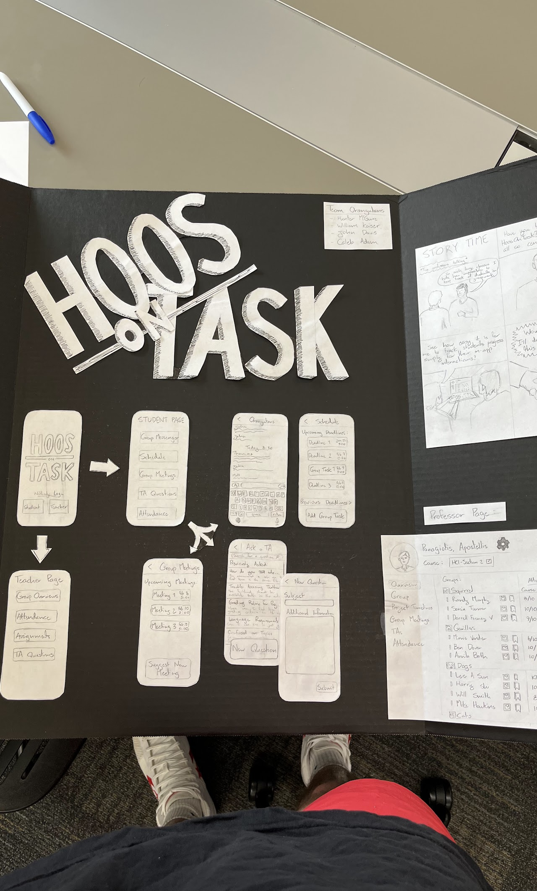

> Image of our Design Studio Board from Design Studio I & II In Class Activity

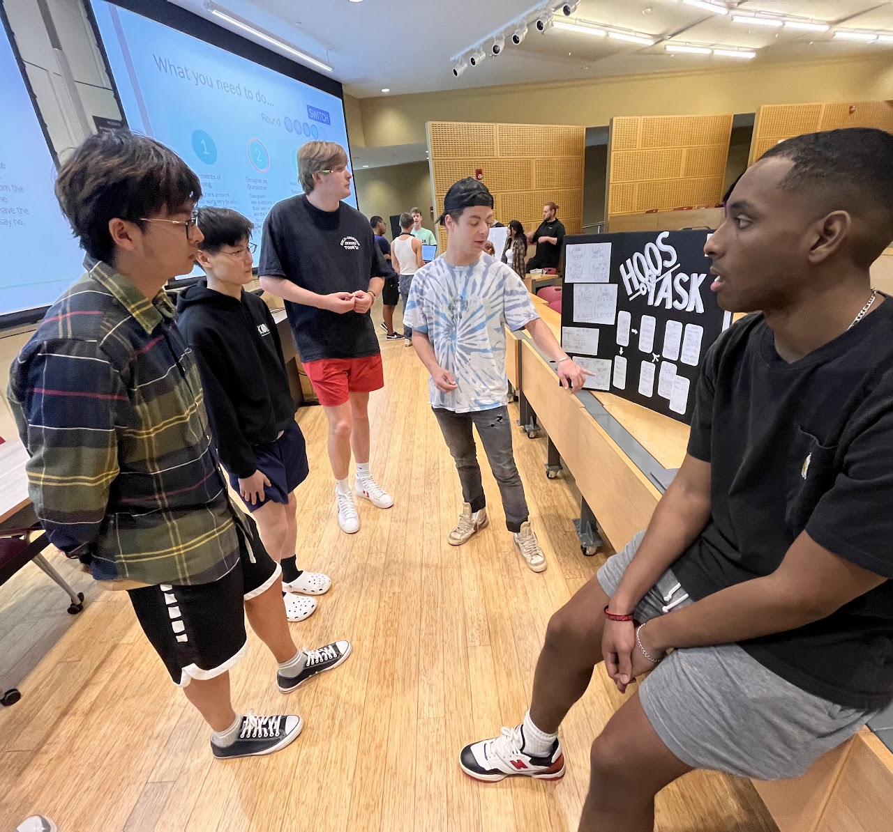

> Presentation of our design to one of the groups.  This activity helps us organize our own ideas on our design as well as allowed us to get feedback from other people.

To begin developing our persona we took a hard look at our WAAD to find similarities between the people we interviewed. We thought about the traits that our interviewers possessed and how they related to our work domain. We took our work activity notes and classified them by our two users, student and instructor knowing we had to end up with two final personas, one of each. Each member of our group wrote down a list of traits that they thought embodied our interviewees and we used the comparison of lists to synthesize a couple of traits that we felt were most important. We noticed a common theme of discontent within the group work environment from part of the students. We factored this into our persona while also trying to keep them non-biased. We attempted to use a diversity of thought to capture a wide range of personas and used that to narrow down to a mutually agreed upon final two personas. 


```toml
[bio]
school= 'UVA'
year= '4th year'
from= 'Fairfax, Virginia'
major= 'Computer Science'
```

Gerald Froople is a driven and hard-working senior at the University of Virginia, hailing from Fairfax County, Virginia. He attended the prestigious Thomas Jefferson High School for Science and Technology, where his love for coding and technology was ignited. His passion for computer science led him to pursue a degree in the field at UVA, where he excels in his coursework and is well-respected by his professors.

Gerald's work ethic is something that has been instilled in him by his parents from a young age. He is the youngest of three children, and his desire to prove himself has resulted in a bit of a chip on his shoulder, motivating him to work even harder. is not a big fan of group work and is willing to take the charge rather than argue with his group members. Gerald is not a fan of Collaboration and rather prefers delegation as it appears to be more efficient in this context. In his free time, Gerald enjoys pursuing hobbies that allow him to unwind and express himself creatively. He has a deep appreciation for ceramics and gardening and spends time honing his skills in both areas. 

As a leading member of UVA's capella club, *HullabHoos*, Gerald is an accomplished singer and performer. He enjoys being part of a close-knit community of fellow music lovers and takes pride in his role as a leader within the group. He is also a big fan of R&B music and enjoys playing the guitar in his free time. Gerald has even released two albums on Spotify and Apple music

Gerald's passion for community service and dogs is also a big part of his life. He volunteers regularly with local organizations and animal shelters, using his skills and knowledge to give back to the community. Overall, Gerald is a well-rounded individual with a strong sense of purpose and a deep commitment to his passions and values. He wants to take these skills into the professional world as an engineer or designer and values group work very much.


> Gerald loves R&B and even decided to make his own album!


> Gerald likes sharing the holiday cheer

### Gerald's Diary Entry

Group work is difficult for Gerald and this is something which he has concerns with himself about.

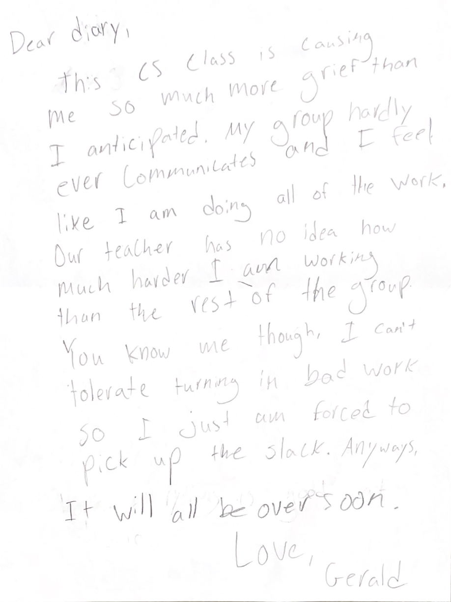

### Our Justification for Picking Gerald

We decided to pick Gerald as our main student persona because his eclectic mix of outside activities coupled with his computer science major made him a good persona. He is in a heavily dependent group work-based major and is obviously extroverted while also being a hard worker. He is driven in group work and is a great candidate for group participation. His goals and experiences align with a user for our app which is why we ultimately chose him. Gerald's commitment to improving his group's work/ work ethic makes him a desirable persona for this project.


> Stacy walking to class on the first day

```json
{
    "school": "UVA",
    "year": "1st Year",
    "from": "New York, NY",
    "major": "undecided",
}
```

Stacy is a first-year engineering student from New York who is unsure of what she wants to pursue for a degree. Stacy is currently enrolled in an introduction to engineering course which is project-based with four group members. In this group work, Stacy values equitable distribution of work more than her time. While Stacy is intelligent, her family and friends describe her as ditsy and claim she has a poor attention span. She has a lot of trouble staying organized and on task.

Being an out-of-state student Stacy finds group work difficult and the climate difficult to adjust. Furthermore, Stacy has issues motivating members of the group. She is incredibly shy and is not effective at sticking up for herself. Despite this issue with group members, Stacy does not escalate, primarily due to a lack of knowledge about proper procedures and fear of creating group animosity. Additionally, in-person group checking feels incredibly confrontational to Stacy. Stacy feels trapped in a “prisoner's dilemma” state of group work. She is looking for a better way to communicate but ultimately would love to stop group work participation altogether.

### Our Justification for Not Picking Stacey

While we think that Stacey could benefit from a service like *Hoos On Task* to hold her accountable for her group work and help her get out of her shell, her lack of commitment to group work may make her a less applicable persona than someone like Gerald whose problems lie in lack of group participation as opposed to personal participation in group work like. 


> Joe in his office after a glass of wine

```json
{
    "school": "UCLA",
    "career": "Strategic Consulting",
    "department": "Economics",
    "from": "Phoenix, AZ",
}
```

Joseph Smith is an economics professor at the University of Virginia. Joseph grew up in Phoenix, Arizona, and attended UCLA. He has two children, a loving wife named Grace, and two children ages 12 and 16. He enjoys cooking, and hiking, and is an amateur-professional fisherman. He is a very family-oriented person and despises dishonesty. He is a relatively introverted person but greatly values the few relationships he does have in his life. Joseph teaches an upper-level economics course that focuses on the application of economics to real-world problems through case studies. As such, group work is a critical part of his cause and part of what makes it applicable to the real world.

Joseph had industry experience prior to his time teaching economics in strategic consulting. He was a hard worker and only teaches for something to do in the midst of his retirement. He is close with his co-workers but has a hard time trusting people because of previous life experiences. He is proficient in Microsoft office programs and prefers those to other technologies. However, Joseph has realized it is very hard for him to gauge student engagement as the only metric he uses for group participation is CatMe. He hasn’t put much thought into group-making and has for the most part done it randomly. He feels as though students are often dishonest in their self-reporting of work and desires a better way to monitor his class’ group work. Often he worries his students do not care about learning the material, but maximizing their grades and tries his hardest to engage his students.

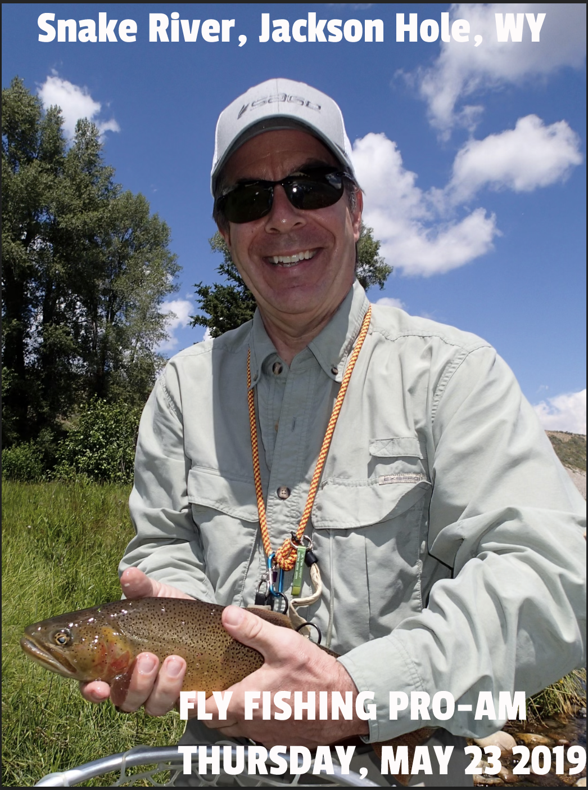

> Amateur Fishing Tournament Ad


> Joseph's 50th birthday shirt

### Our Justification for Picking Joseph

We chose Joseph as our Instructor persona because he fits the criteria well. His nature as an untrusting person is in line with the characteristics of an instructor who would utilize *Hoos On Task*. Additionally, his commitment to student engagement and group work makes him a desirable candidate. He balances introversion and Collaboration in his own life which are characteristics that align well with our current system. Additionally, He wants to be able to monitor his students more effectively in group work and has trouble communicating effectively with said groups. 


```toml
school='UVA'
career='Financial Technology'
from='Charlottesville, VA'
department='Computer Science'
```

Alexis Volkov is a professor of Computer Science and the University of Virginia teaching Software Development Essentials. She is from Charlottesville and is a UVA alumnus. She is unmarried and has three cats. Her hobbies include knitting, journaling, and doing research. Her professional career began in engineering and ended up as a high-level executive at a fintech firm. Her arthritis has limited her cross-country running career and debilitated her to a life behind a computer. 

Alexis is passionate about this course and set up the course to actively encourage group work. However, group work is not mandated. Alexis feels that this setup provides for a modality of gentle encouragement of group work.

Alexis uses GitHub to monitor group progress and has teaching assistants check the commit history of each project to identify groups to which some members have obviously not contributed. Apart from this, Alexis does not seek formal monitoring solutions as the project-based course allows group members to leave groups after every week. Her philosophy is simple, she thinks advocating for yourself in a group environment is an important skill and believes causing students to get out of their comfort zone on their own in group environments is imperative.

### Our Justification for Not Picking Alexis

Though we also believe our service could be applicable to Alexis, her lack of commitment to monitoring group work makes her a poorer candidate than Joseph. Though her philosophy of unmonitored group work does teach students valuable skills, it does not make her a good persona for a service like ours. However, her commitment to her student and to group work make her a solid option. 

## Design Planning and Ideation

User Tasks and Activities Supported

- Student Page 
 
 - Create/edit their profile
 
 - Make a profile with their interest, hobbies, group strengths and weaknesses
 
 - Scheduling
 
 - System allows members of the group to select which dates and time they are most available, and compiles this data to show the specific date and time frame where students should meet
 
 - Messages
 
 - Students will be able to message each other as well as the TA and professors to discuss the project they are working on as well as any questions that may arise.
 
 - Attendance/meetings
 
 - Allows students to keep a log of meetings throughout the semester.  Additionally, students can post notes from the meetings that can be viewed by all members of the group in case of absences, etc.
 
- Professor Page
 
 - Create/edit Profile
 
 - Make a profile with their interests, teaching specifics, course requirements, and any other information of their choosing
 
 - Class Project Creation
 
 - Instructors will have the ability to create or add a class project with the attached assignments to the app. This will make the project visible to all students in the class and allow them to plan and and give the instructor oversight of the assignment within the app
 
 - Group creation
 
 - Instructors will have the ability to load the class rosters onto the app, then group students based on their strengths and weaknesses provided in their bios.  If the professor prefers a more randomized approach, there is an option to randomize the groups by selecting the roster then providing the number of students the instructor wants per group.
 
 - Message
 
 - Instructors will have the ability to message individual students, groups, or TAs in order to provide assistance on the project.
 
 - Metrics
 
 - The professor will be sent an organized page that depicts different statistical data about the group.  This data includes attendance rate, participation on different sites like google docs and google sites, the tasks completed and remaining, and submission history.  The instructor will use this data to monitor the groups, if they so choose, and message them if they notice aspects of the group work that needs to be changed
 

## Ideation and Sketching Process

Our group met multiple times for the ideation and then sketching process. At first we compiled our list of tasks which were derived from our DIMs. We compiled the list above and then we began to think about the features and different pages that would be useful on our site. Before we began the design project we reviewed our flow models to ensure that we had all possible tasks and pain points covered in both our activity layout as well as our sketches. We also made sure to keep both our student and professor personas in mind. As we considered our design, we understood that the two primary users classes, students and instructors, would have very different pages and tasks. This is why we chose to break our group up and half the group worked on sketching a design for the instructor layout, and the other half working on the student pages. We conducted rounds of rapid sketching and compared ideas through iterations to reach our final design for the two respective pages. It was easy to divide the work in our group as the two pages needed to be so different that it became easier for individuals within our group to zone in on one user/persona. Our group met multiple times either in Rice or the Thorton stacks to work on ideation and sketching. This is where we shared ideas and iterated our designs by drawing on the white board and on printer paper. We came up with many of the sketches below and conducted group discussion to determine the pros and cons of each idea.

## Workspace and Material

The materials used were sketches done on paper and pencil.  We created several rough drafts which gradually progressed throughout the design process.  We drew our sketches during some office hours periods, and also in Thorton Stacks.  When we could not connect personally, we created some sketches on our own time.  We then compiled these sketches together to create a roadmap and guide for how our interface will look. 

## Client Feedback

Another critical piece of our design planning and ideation was the feedback we received from our client.  We briefly discussed with Professor Turner our design ideas, and showed her the sketches that we developed.  She liked our design ideas and also supported how our app is two sided, that is, an interface for the student and an interface for the professor.  

She did suggest, however, to not "clutter" our pages too much.  She said that part of our app's appeal is how it is simple and also easy to understand.  She said that too many tabs, layers, and functions would create confusion among the user which would go against our ultimate goal of creating an organized way to structure group work.   She said that we should make each tab concise to 1-3 functions, and that the layout of these tabs should be in a way that is widely known across multiple apps.  This is something we internalized and followed through with during the subsequent stages of our design process 

Additionally, she recommended that the professor page should be accessible on the web as well as on an app.  She said that in her experience, most professor tend to do their work on their computers, and by having *Hoos On Task* available to them via their desktop or PC, we would add another layer of ease of use.  She also pointed out how the metrics would be more easily visible on a computer as opposed to a mobile app, so any trends or discrepancies that a professor might notice should be displayed on their computer.  For instance, if an instructor wanted to meet with a group and show them their metrics, it would better to view these metrics on the computer.  This was excellent advice for us because it highlighted a simple fix that we initially overlooked. 

## Rough Sketches Developed During This Period

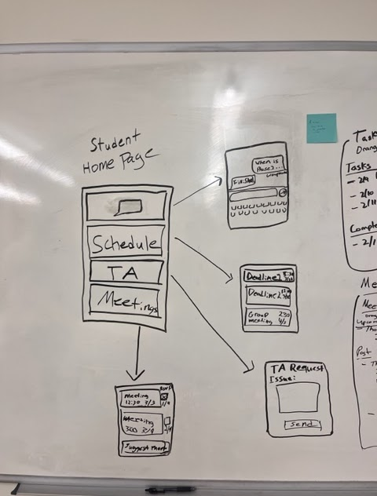

> Rough sketch of the student home page

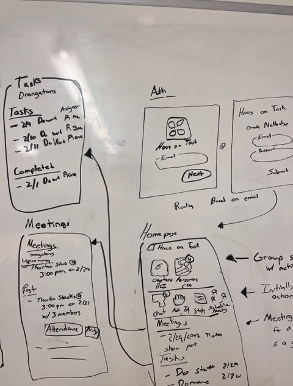

> Sketch of individual pages within the app

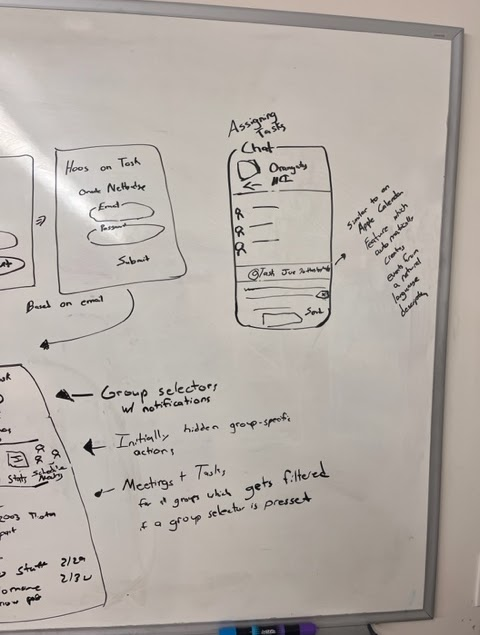

> Sketch of the the assignment and chat page 


> Sketches highlight the initial ideas presented to our client as well as rough sketches that were modified after our conversation.

## Mockups

Since our project is an app, there will be no physical interaction between the system and user.  As a result, we did not include any mockups.

**Summary:**

In coordination with the textbook qualifications, we analyzed our Designer’s Mental model through an ecological, interactive and emotional lens.  In short, we wish to portray our system as a way to keep students and professors better organized and transparent when conducting group work.  A good way for the user to look at *Hoos On Task* is almost as a planner that monitors what you have done, what you have to do, and how you have to do it. 

**System Description - Ecological:**

*Hoos On Task* will be a school-based app which allows for students to stay organized in group work, and the professors to monitor and manage this group work at their leisure. The student user is able to interact with the interface through a mobile app, where they select different icons depending on the task they want to complete.  These icons range from group messaging, a tab to record meeting information and scheduling meetings.  The student navigates through these sections through clicking and swiping between tabs.  As for the instructor user, they are able to interact with the interface through an app as well as a website link which they can pull up on their personal computer.  The link will allow them to view the statistical data about each groups’ participation , while the app will allow them to message and communicate with the students and TAs.

**System Description - Interaction:**

1. **Student Page:** When a student first opens *Hoos On Task*, they will be greeted with a create account icon.  Once this button is clicked, they will be prompted to enter an email (preferably their UVA email) and a password.  Next they will be asked to create a profile. In the profile section they will be able to type out their name, and the subsequent sections will ask about their major, interests, school year, hobbies, etc.  The only required section of the profile will be the name, but the other sections will help students in the group get to know each other better.  After the profile is created the student will be brought to a page with several different options: message, schedule, meetings.  The messages tabs will have an icon with a text bubble.  When the student clicks this option, they will be brought to a page with the various messages that they will have.  They will have the option to create a new conversation, where that be with an individual group member, the entire group, their TAs or the professor.  Once this conversation is created a keyboard will appear where they can start communicating.  The next option, schedule, when clicked will take the student to a page where they can select dates and times which they feel would be best for them to meet with their respective group members.  When these options are selected, the app compiled this data into a schedule like chart that shows which days groups members can meet, so the group can coordinate their meeting times.  The final option, meeting, when clicked by the student takes them to a page that displays a log of their meeting days.  When the student selects which day they want to look at, it takes them to a page where they can see the notes that were taken and a summary of what was discussed.  These notes are posted by the students, or they are imported directly into the app through the import button.  This feature allows the student to link files from google drive, google docs, word, powerpoint, etc, directly to their meeting log.  They can then add to the documents, or just keep these files as a  record of what was completed during the meeting, and for access in case one member was absent or if any member needs to look back at their past work.  These interactions aid the the physical and cognitive affordances by allowing the user to understand what they are clicking and the role of each click on furthering their work.
 
2. **Professor Page:** Similar to the student page, when an instructor first opens *Hoos On Task*, they will be prompted to select the “Create Profile” option on the screen.  This will take them to a page where they can enter their school email address, and provide a bio with their name, what they teach, and any other information they wish to share. Once they do that, they will be taken to the “Group Selection” page.  On this page, the instructor will simply upload their class roster, then by selecting students' names they will place the students into a group with the number of members of their choosing  However, if the instructor prefers a purely randomized approach, they can select the randomize option, and the app randomly selects groups based on the class roster and the number of students per group that the professor selects.  After the groups are created, The professor is taken to the main page where the options “Message” “Project” and “Metrics” are displayed.  If the professor selects, they will be taken to the same page as the student, where they can select students, groups or TAs to message about project concerns and tips.  If they choose to select a project, they are taken to a page where they post specifics about the project that they assigned, as well as edit due dates, deadlines, and post reminders to the entire class.  This page will be linked to websites like Collab and  Canvas, so that they will not need to entirely recreate the project instructions.  All they will have to do is click the connect feature, and they will be taken to their class page on Collab/ Canvas, where they can then import the guidelines onto the app.  Finally, the metrics tab will take the professor to a visual diagram depicting different statistical data on each group.  The page will have a list of each group name, and when the professor selects that group name, a display will appear which shows data of that groups attendance rate, the percentage of the total project that is completed, The past tasks that they completed as well as the future assignments not yet completed, a chart of participation between each member of the group and the levels of Collaboration as compared to other groups in the class.  These metrics will be calculated by looking at data from google doc participation, as well as the student’s log from their meeting notes.  The instructor will have the option to view this information, and if they notice any glaring disparities, they can message the group in order to overcome these obstacles. The professor page focused on functional and sensory affordances through the metrics.  The user will be able to clearly see the participation between each group, and displaying it on a computer screen will add to the functionality of these metrics. 
 

## System Description - Emotional

This interface was designed to consolidate and organize the process of completing group projects, while also helping the professor manage the multiple group projects they will have to grade in their class.  One of the major focal points of the design was to ensure that the app was easy to understand.  The incorporation of large buttons with universally known labels allows for people with even minimal technological knowledge to understand how to maneuver through the app.  

Furthermore, the addition of linking the app to widely used interfaces like Collab and  Canvas aided in the simplicity of the app, because this allows for both the students and the professors to access documents that they have worked on without the tediousness of rewriting or reformulating their ideas.

Organization also plays a role in the ease-of-use of the app. Each section of the app, specifically the meeting tabs, will be organized in a way that clearly displays the tasks completed, as well as allowing for smooth editing and hyperlinks to google and microsoft.  

All of these features once again are fundamental to the ultimate goal of creating a more organized, consolidated and easy process for completing and managing group work. 

## Mental Model Process:

For this step, we considered the ways that our design would be incorporated in a typical classroom setting.  We used our old interviews with students and professors to hypothesize how an individual would use our app, and what features would make this use better.  One of our biggest takeaways was when speaking with our client, she advised us that many professors want simplicity in their interfaces.  When there is an excessive amount of features, people can become confused and overwhelmed, resulting in inefficient use of our app and subsequently taking away from our main goal.  We began to emphasize conciseness and simplicity in our design, and thought about what would help us accomplish this.  So we focused on the amount of features we have, the connection between our app and other interfaces commonly used, and having icons, labels, and symbols that are widely recognized for ease-of-use.

After creating a mental model, we organized our thoughts using both the desires of the users, as well as data we gathered from our WAAD and DIMs. From these models, we realized that what people value most, from a student’s perspective, when conducting group work is organization.  From an instructor perspective, we noticed that they tend to value reliable and simple technology.  In this section, we developed conceptual designs based on these observations, as a way to further guide us through the design process.  This process helped us navigate our thinking by identifying what pieces of our design we needed to refine and what aspects we needed to expand on.  Specifically, we found that adding features such as a way for all scheduling plans to be posted on a page, as well as allowing the app to be accessible on the web for professors, meets the needs of the user while maintaining the fundamental ideas of our design. 

We also mapped out various breakpoints, and implements how we could remove these breakpoints from our design to better match our mental model with the experience of the user. 

When mapping our design, we wanted to ensure that the connection between the user experience and the designer's mental model was strong.  When reviewing our design, we found that one of the main breakpoint was navigating between the various tabs within our app.  If the user does not understand clearly how to get back to other tabs, this will create un necessary confusion and worsen the user experience. 

So, we concluded that in order to fix this breakpoint, we must have a clear and concise return buttons on the top corner of every page.  This button will take the user back to the last page that they were on.  For example, say the user is on the home page, then clicks the messages tabs and enters our messaging page.  When they need to return to the main page, there simply click the left arrow button on the top left of that page and it will return them home.  Each tab will have this button in the same size, layout and font, in order to alleviate any confusion on how to access previous pages. 

Another breakpoint that we identified was maintaining the connection of simplicity between both the Instructor and the student.  We wanted to make sure that our app only heightening positive emotions surrounding group work, and lessens the stress associated with these tasks.  We highlight this in our emotional perspective conceptual design (see below), where we ensure that *Hoos On Task* fosters a sense of organization, accountability, and removes confusion between both the instructor and student.  If these emotions are the same for both types of users, the interface will allow for a smooth Collaboration between the two and will help produce excellent group work.

## Conceptual Design : Ecological Perspective - Within External System

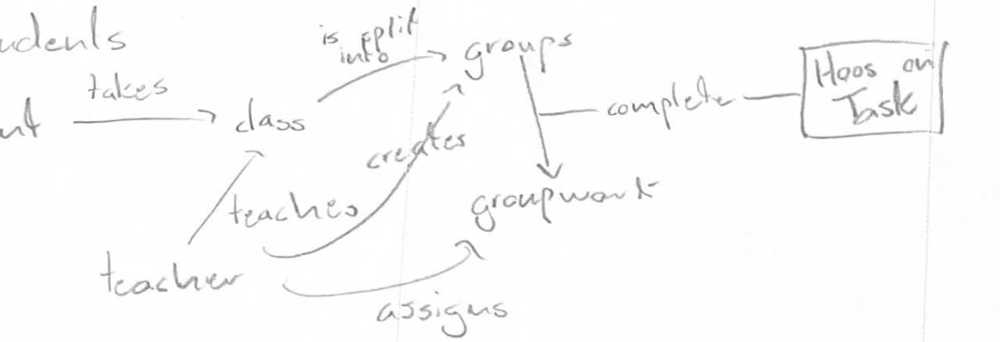

In this model we were focused on relating the role that our App plays in the external system of group work within a class. Specifically, it was important to show which steps of group work *Hoos On Task* is designed to aid with, because given previous feedback this was a breaking point in the mental model of the designer vs. that of the user. The app is designed to aid the user with organization and simplicity in the actual process of completing group work, and this diagram helps show what part of the group work process *Hoos On Task* is specifically helpful with. This design is especially important in reinforcing the cognitive affordance of what users and client will be using *Hoos On Task* for. 

## Conceptual Design : Ecological Perspective - Internal system

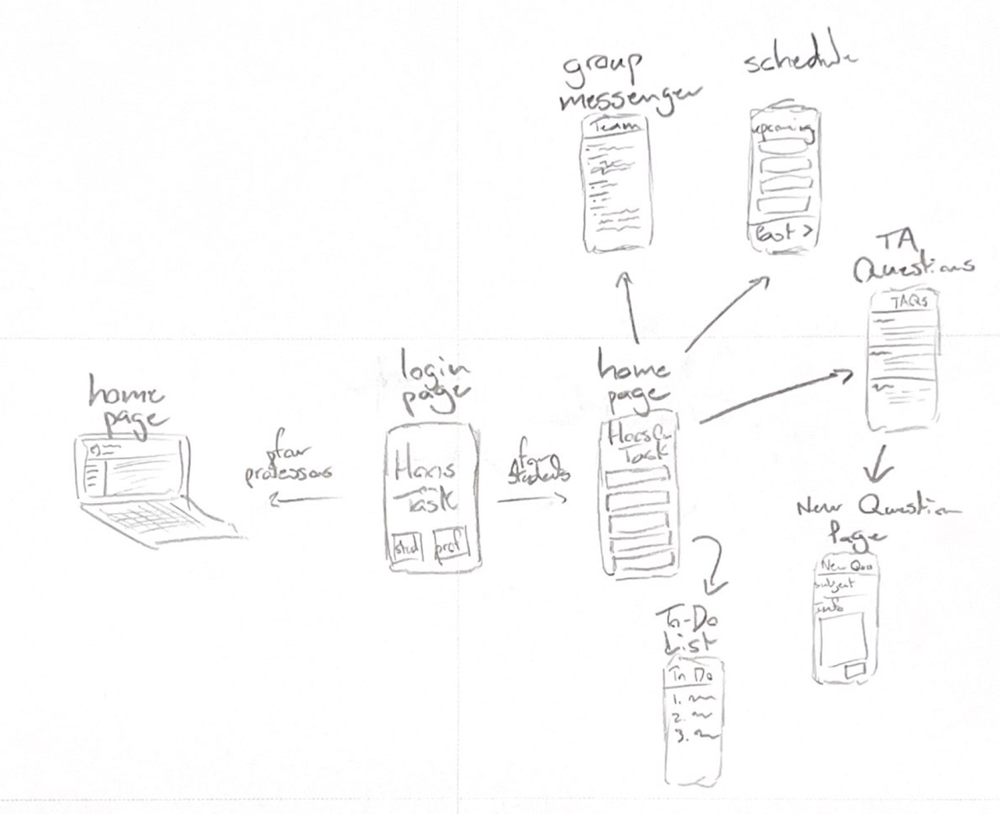

User flows for both professors in students. The professor has a home page which provides an at-a-glace view of each group. The student's homepage has all of their tasks, a link to the group chat, a link to questions and a link to meeting. The homepage was designed to show task and meetings without forcing the user to click on them. However, clicking on the task provides an expanded a focused view. It is also important to note how while students who login on their phone will be directed to a home page that then allows them the full functionality of the app, professors logging in on the app will be directed to log in on a computer, as their site is not mobile-supported. This was a decision that was made from feedback. 

## Conceptual Design : Emotional Perspective - 

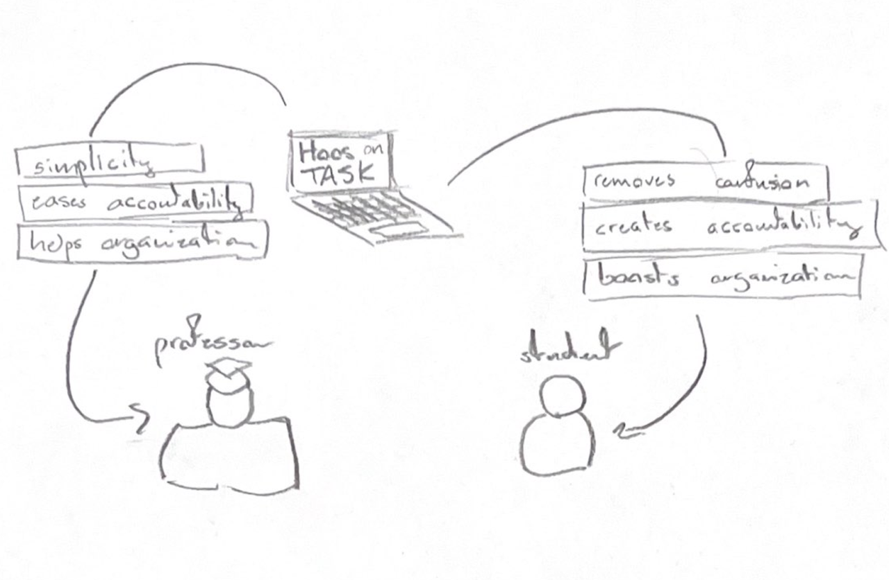

This conceptual design is meant to show what both students and professors stand to gain emotionally from *Hoos On Task*. This diagram illustrates the main benefits of *Hoos On Task* toward both client and user with respect to emotional impact. Keeping accountability for students in group work can be both stressful and cumbersome for the client, and confusing and frustrating for the user. *Hoos On Task* alleviates these issues by centralizing & easing accountability, and allowing the user to be properly graded and weighted.

## Conceptual Design : Emotional Perspective - For Students

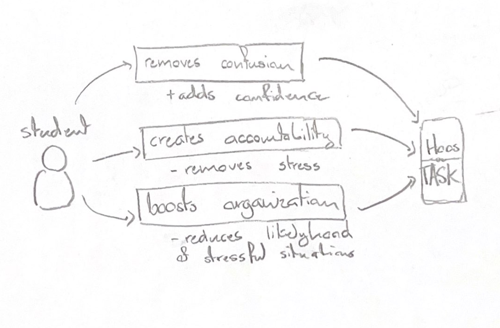

This conceptual design shows the emotional impact of *Hoos On Task* for the user. Specifically, how removing confusion increases user self-confidence, how creating accountability for group members removes stress over fair-weighting for grades, and how boosted organization reduces the likelyhood of stressful situations such as having to do the whole project at the very end. 

### Conceptual Design : Emotional Perspective - For Professors

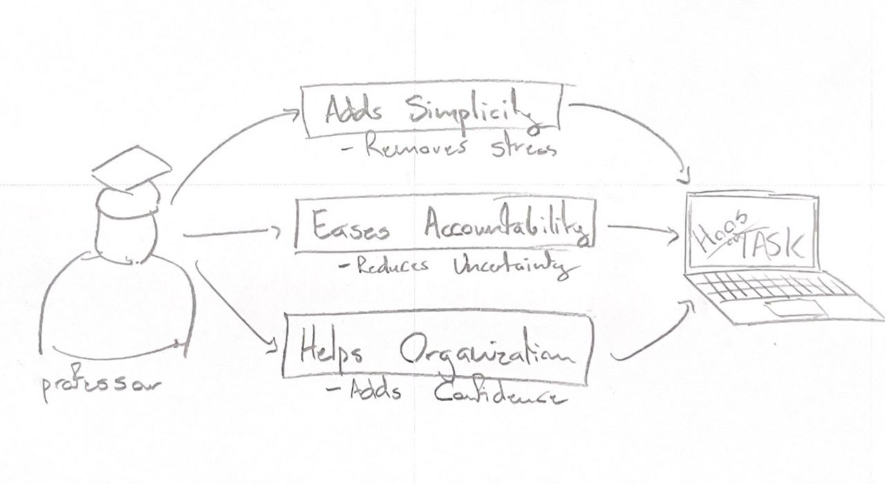

A key part of the value proposition for *Hoos On Task* from an emotional perspective is the moderating effect that *Hoos On Task* can have. Proper organization is very much a preventative medicine for stress, uncertainty and a lack of confidence. *Hoos On Task* keeping everyone organized, accountable and transparent prevents situations from devolving.

### Conceptual Design - Interaction Perspective - with external devices

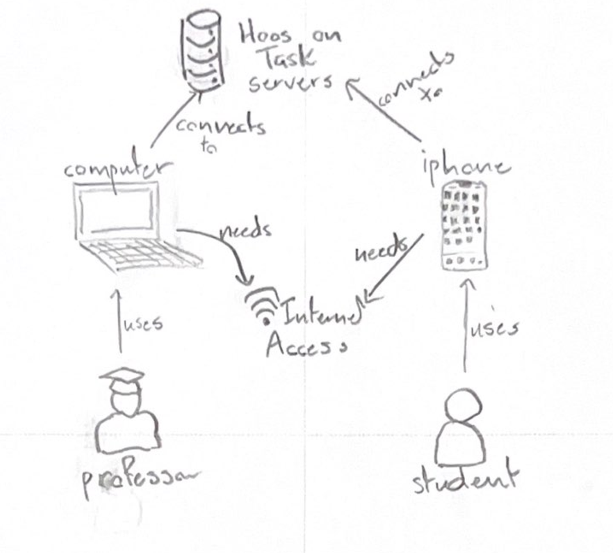

*Hoos On Task* information design. For development complexity purposes, this app will initially be designed to be monolithic in nature to minimize development complexity. This structure could be changed as needed to use a separate system of chat and the TAs using something like Cassandra. This diagram therefore simply connects the *Hoos On Task* monolithic servers with the people / entities necessary to its basic function. A cognitive affordance we wanted to make especially distinct in this conceptual design, as well as in a few other diagrams, is that the client and user pages are very different, and specifically on different devices. While the professor can login on their phone, they will then simply be prompted to login on a computer, and contrarily users will only be able to access the site on the app.

## Scenarios and Storyboards

When designing the storyboards, there was much deliberation around how to clearly demonstrate the value of *Hoos On Task*. Some group members wanted to show the disconnect where professors valued group work and the students did not. Some group members wanted to focus more on the students. 

## Final Storyboards

Our group worked Collaboratively to develop our two final storyboards by utilizing a combination of individual brainstorming and group discussion. Initially, each member of the group generated several ideas for potential storylines and shared them with the rest of the team. From there, we discussed the strengths and weaknesses of each concept and Collaborated to identify the most promising ideas. Once we had narrowed down our options, we split into smaller teams and began fleshing out the details of each storyline. Each team brought their unique perspectives and skill sets to the table, allowing us to explore the potential of each story from multiple angles. Finally, we reconvened as a group to present and discuss our two strongest storyboards, making tweaks and revisions until we were satisfied with the final product. Through open communication, active listening, and a willingness to compromise, we were able to develop two compelling storyboards that showcase our collective creativity and Collaboration. We included two final storyboards to capture the perspective of both instructors and students.

### Instructor Storyboard

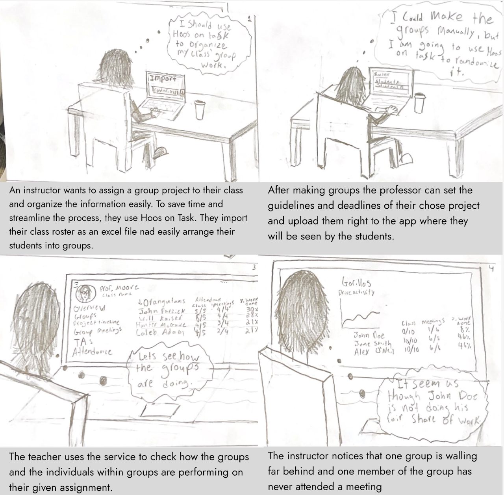

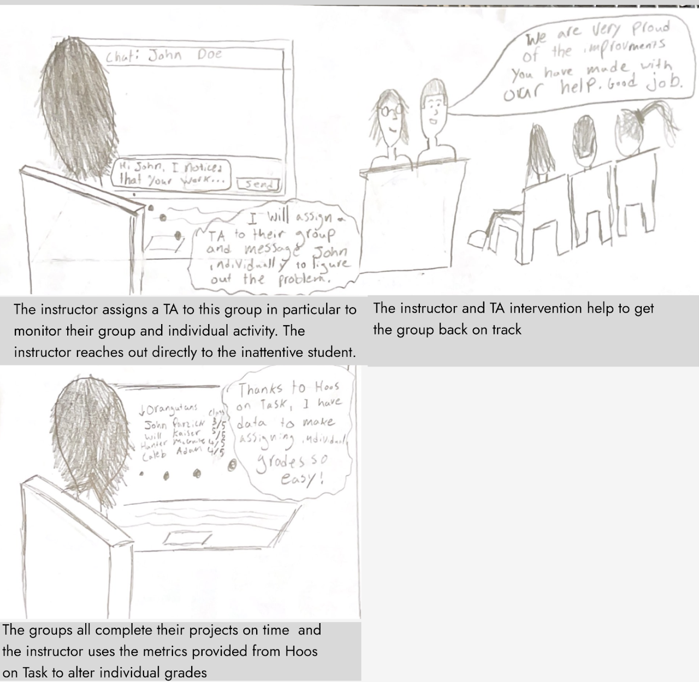

### Student Storyboard


## Storyboard Rationale

For both of the respective storyboards, we kept our personas in mind. From the student perspective, we consider the process from the beginning, which we always envisioned being a teacher forcing their student to use *Hoos On Task* to monitor them. We assumed they would initially not be happy about this but as they understand the app's utility and ability to condense all relevant information they would grow to appreciate it. That is what is supposed to be conveyed in that storyboard. While the storyboard does not display every feature covered in our HTI we felt it was comprehensive enough to cover all of the most important features. As for the instructor storyboard, while keeping our instructor persona Joseph in mind, we developed a story that included the most important aspects of the service for the instructor. Being able to easily upload the roster, track student metrics, and easily give aid where needed. This is the ethos of the service from an instructor's perspective. All in all, Collaboratively we were able to make storyboards that convey so many effects of our system. 

## Storyboard Drafts

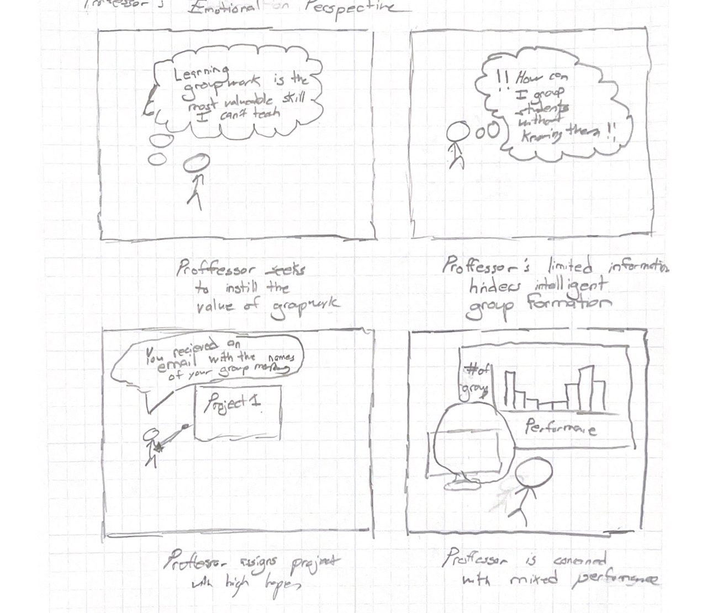

Storyboard concept where the professor's stated mismatch between the value they put in group work and the performance they are able to get from groups is focused.

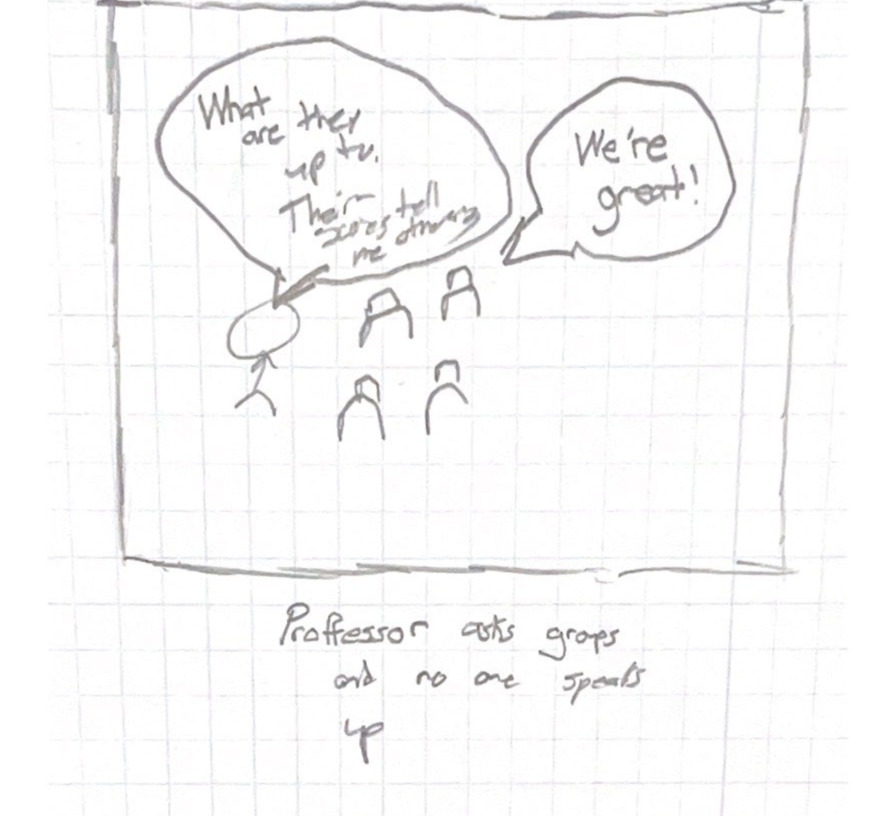

(continued) Storyboard concept where the professor's stated mismatch between the value they put in group work and the performance they are able to get from groups is focused.

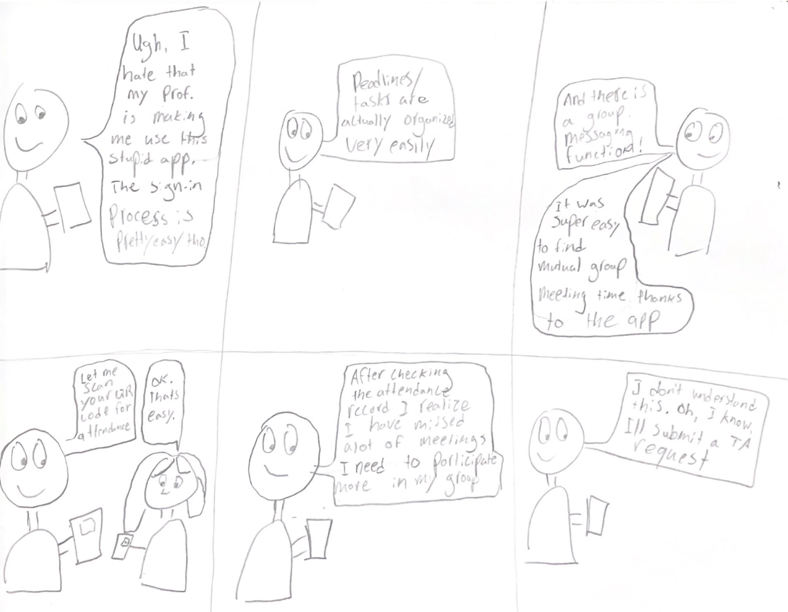

Active moderation storyboard concept. This demonstrates the ability for  the professor to use *Hoos On Task* to make a moderation. The group liked this, but preferred to show a student success instead.

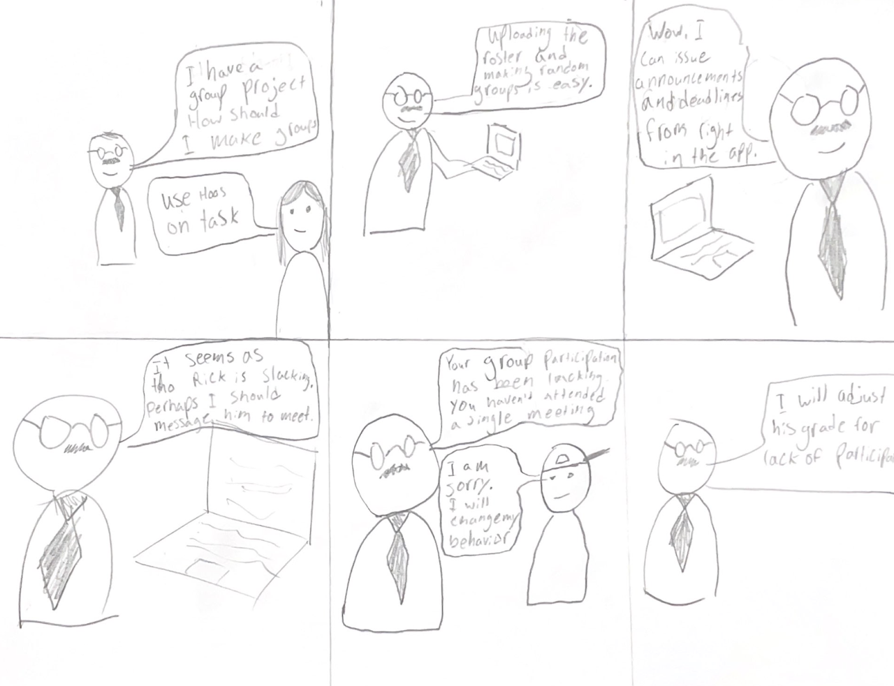

Student use case storyboard concept showing the features and touch points that the student can utilize to keep themselves organized.

## Wireframes

The process of creating wire frames was heavily focused on iteration. First, members of our group independently came up with designs for key parts of the interaction. Namely, the home screen and chat functionality. This initial independence helped ensure a variation in designs from which the key strengths and weaknesses of each design would be identified. After this deliberation a more refined mockup was created.

Some parts of the design, however, required less iteration such as the student-onboarding modals which we felt clearly communicated the value of the product for students as soon as they load the app.

### Professor's Wireframes 

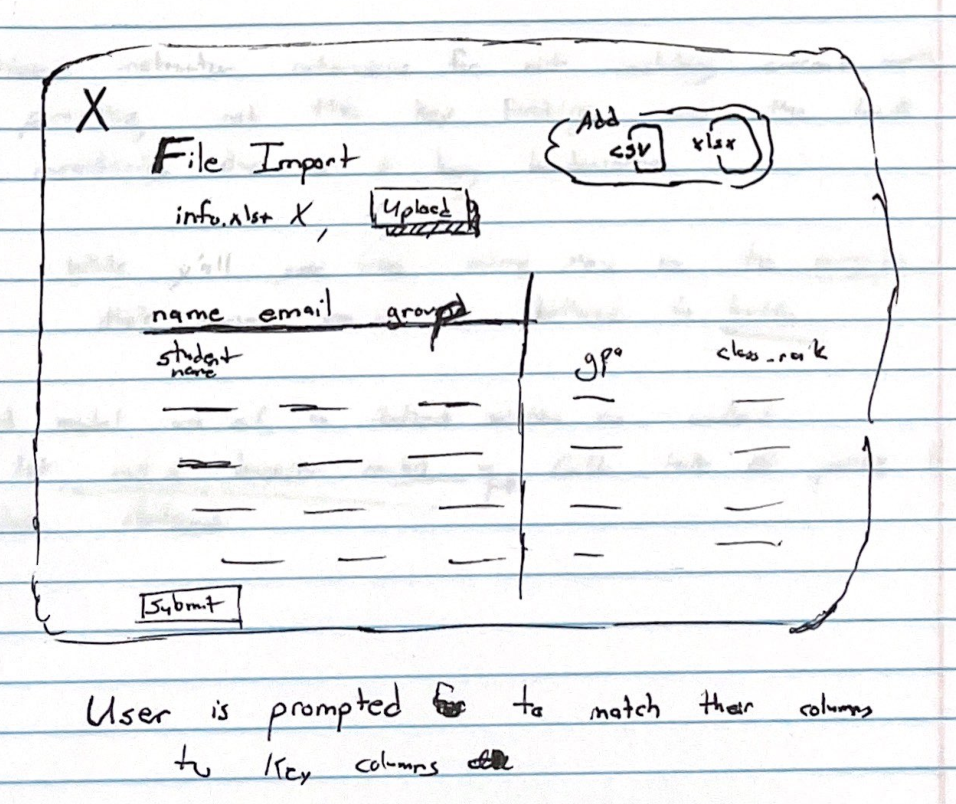

### File Import Modal

If professors have existing files with students information in them, they need to be able to easily import them.

The file import utility reads the file and extracts the columns. Because the system does not automatically know which columns is which and we do not want to force the user to specifically name columns in this sheet, we require a matching utility. 

This modal separates the necessary imports (name, email and optionally group) from the extraneous ones which is whatever else the professor has in their sheet.


### Manual Import Screen

Professors initially create groups by importing the class. By default this import will be manual. However, by clicking on the bulk import button on the top right, the professor has the ability to import from either CSV or XLSX. 

After importing the class, the professor can use the checkbox to select students and form a group. We liked this checkbox interface because it bears similarity to email tools. 

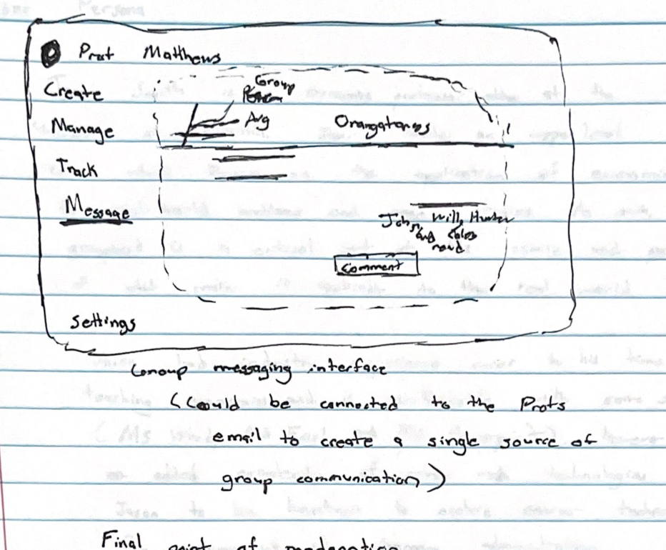

### Early Version of Professor Page

This was a rough outline of the professor's dashboard where we were planning out the relevant information to be shown on each page. 


### Import File Wire Frame

This is an early design for the import file wire frame. There are two main columns, the key columns which are name, email and group and whatever additional columns were in the document that the professor uploaded with the excel file. 


### Early plan for Create Class

In this early plan for create class we liked a pretty standard form with a linear layout.

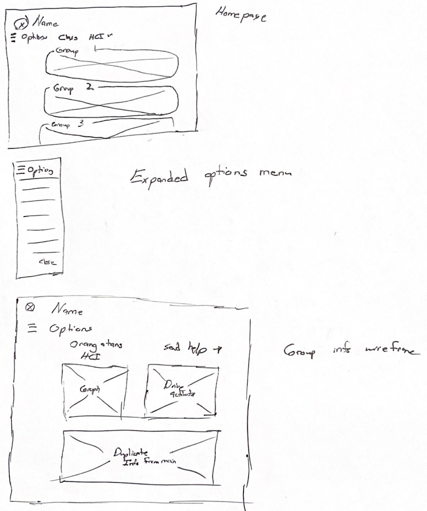

### Professor Homepage

When initially planning out the professor's dashboard, we though of having a group list view which shows an at-a-glace view for each group.

Navigation is done by a hamburger options menu. Though in later iterations we move away from the collapsible menu design in favor of a fixed design which helps remove ambiguity around navigation.

Also of note is the group info page is the split-pane design between a Google Drive contribution graph and a breakdown of contributions by person. Because people read from left to right, the drive graph first tells the professor if the group as a whole is in trouble and then tells which students are contributing to that trouble. 

Furthermore, there is a send help button on this page for delegation to TA. We thought that completing this though a micro-interaction (rather than a separate form) would make this interaction faster for the professor and reduce context switching.


### Professor Group Page

This is an alternate version of the professor's page which a groups contribution to Google Drive as a graph as well as other miscellaneous information. 

While the information contained on this page was less flushed out, we liked the permanent navbar as we felt that it lead to less ambiguity.

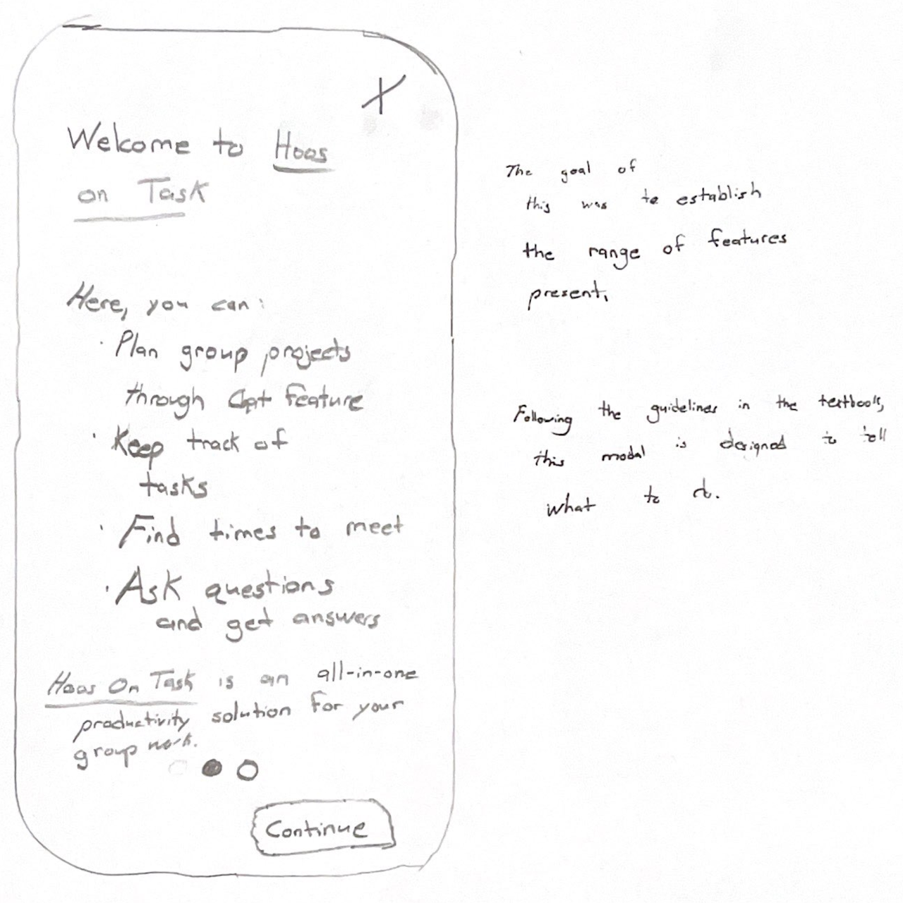

### *Hoos On Task* Student Welcome Modal

This is a welcome modal which is the first thing the student sees when installing the app.

Following the UX Guidelines, this modal was careful to tell the user what they can do, not how they can do it.

Finally, on the bottom, there are two circles which show which page of the onboarding the user is on through the dark circle. 
 

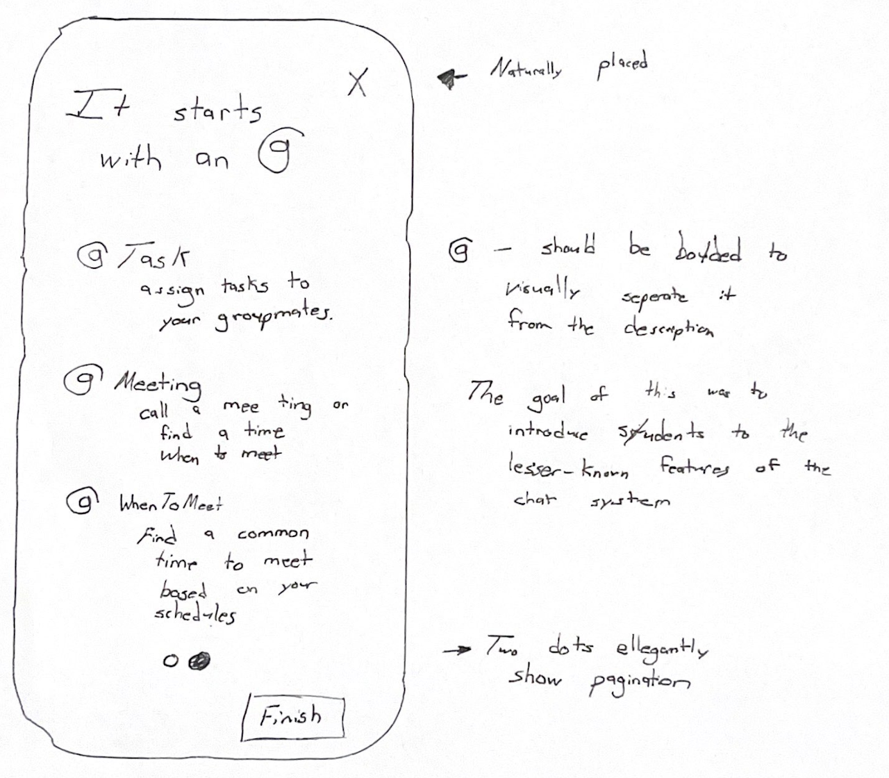

### Student OnBoarding Part 2

The goal of this modal is to introduce the user to the concept of `@` in the context of group conversations.

- `@Task` - is for task creation 
- `@Meeting` - is for setting a meeting time
- `@WhenToMeet` - creates a poll to find a time to meet
 

These features are critical because they are what distinguish *Hoos On Task* from iMessage and other competitors. This is important because establishing the value proposition of *Hoos On Task* immediately is how students are.


### Groupwork

This is one of our early concepts for the chat screen.

Though chat rooms have existed for nearly as long as the internet and the layout has been standardized, implementing our custom features was interesting. 

We though that adding meeting information in the bottom area of the screen which is unused by modern phones.

However, in later designs, we decided to move away from this approach as it was less specific.

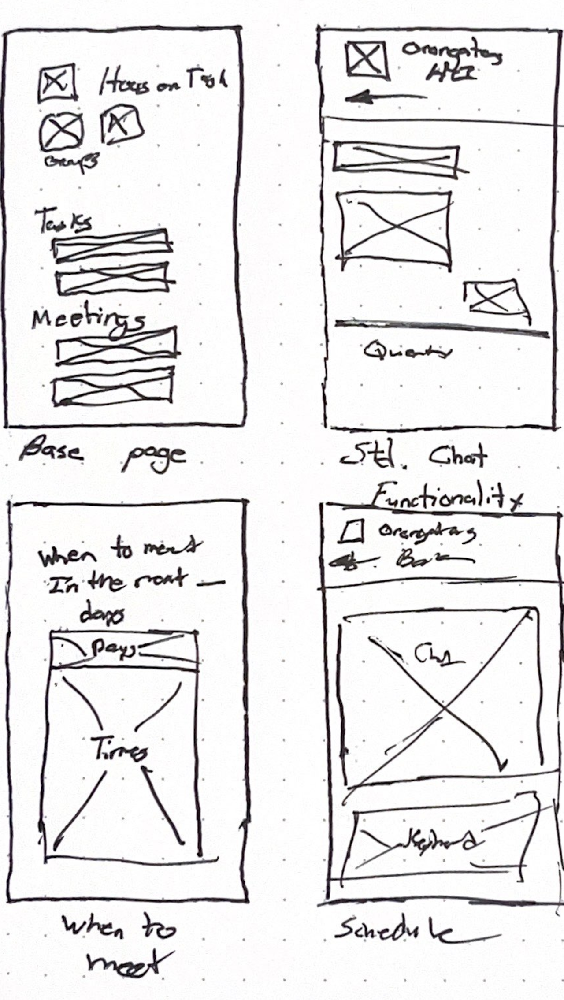

### Student Site Wire Frames

These were initial wire frames of us planning out student app. 

A key concept we were thinking about was multi-group management and how to keep all group information displaying on the home screen while keeping tasks and meetings on the homepage. 

When discussing this, we liked the idea of having an icon for each group and having this act like a filter where selecting a particular group would filter the tasks and meeting to only that group's tasks.

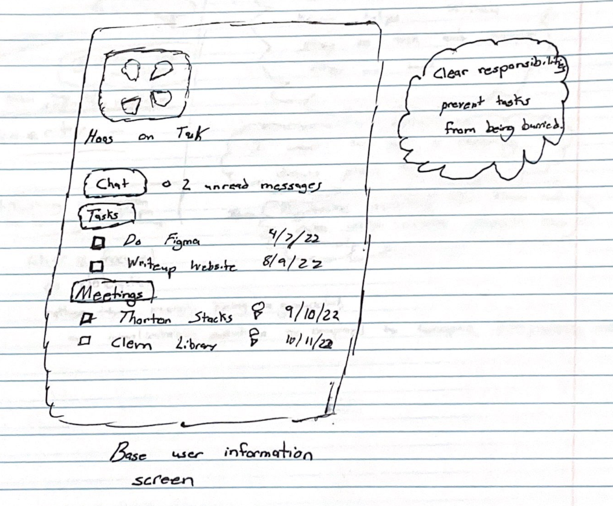

### Hoos On Task

This was a design considered for the very first screen upon loading *Hoos On Task*. 

Though we liked having a large logo and title and not having clickable content at the top of the screen (where it is difficult to react for mobile users). 

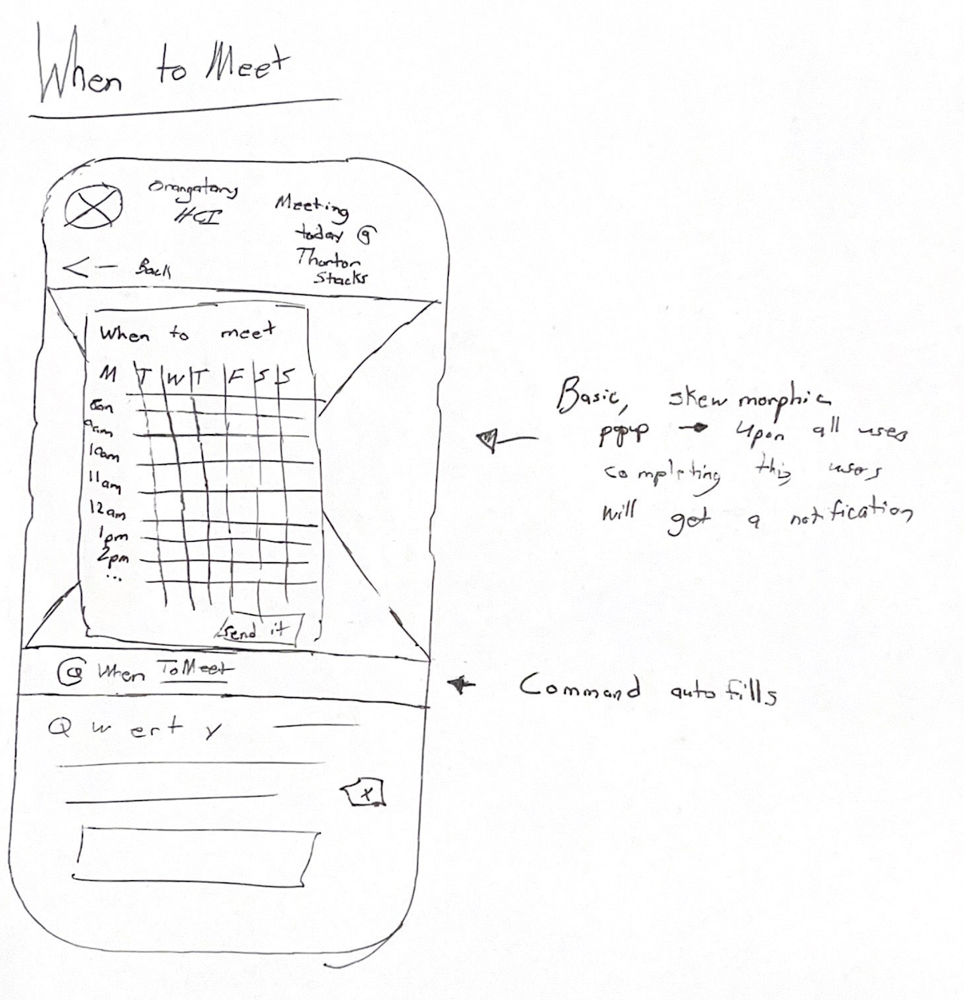

### When to Meet

This design features an updated chat section.

The chat section has an information-packed header which shows the next meeting. 

The when to meet modal is basic and employs the drag and  lift method of blocking time which is used by Apple and Google calendars.


### Variants of Student Homepage

These are some wire frames we used as points of comparison during our wire framing process.

The first one had a clean aesthetic by displaying the group names and logos to the right and well as actions to the right group names. However, when deliberating this design, we felt that at groups counts greater than two, the design would not scale well.

The lower design was based on the idea of mobile-optimized design with key user actions being closer to the user's right thumb. 

### Final Wire Frames and Client Feedback

For ease of communicability, this section will have the wire frames presented to the client, the comments the clients gave and some opportunities for improvement / changes to make moving forward based on this feedback.

### Professor's Wire Frames

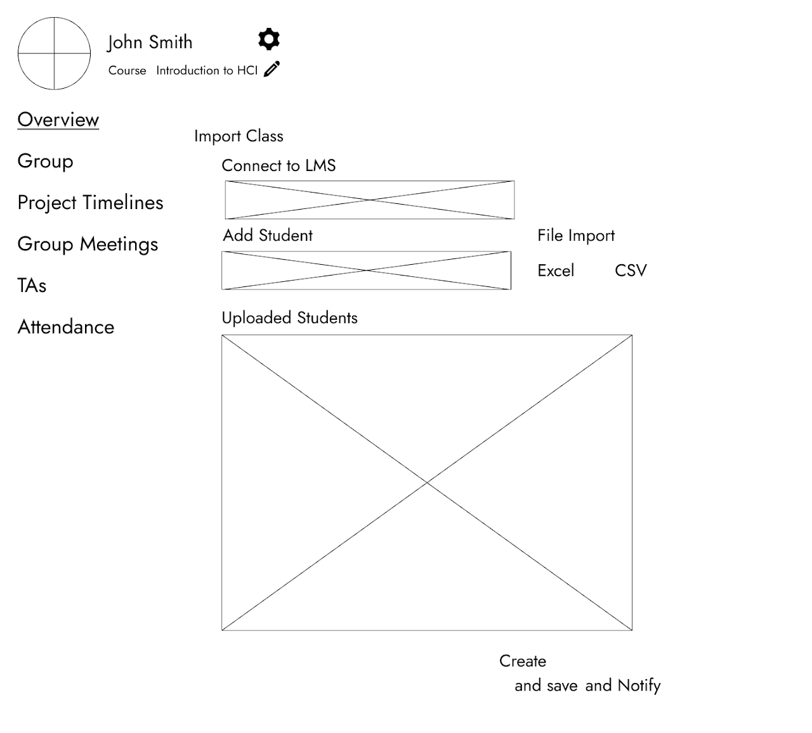

## Professor Course Import 

The client liked the simplicity of the simple form for importing their class. The connection to their LMS is something which is really important to them and the ability to not have to create groups in two places is something that they said they would use. 

The input box to add students was something that they found intuitive as well as the file import.

Explicitly stating the types of files which can be uploaded helped clarify things. 

One thing they did not like however was the Create and save or Create and notify section. The client believed this was too clever to be useful.

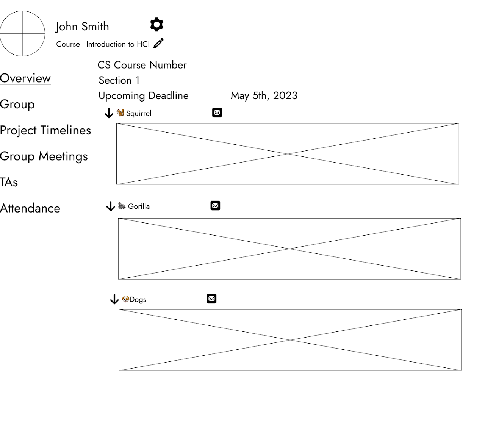

### Professor Dashboard

This screen is the main dashboard which is the first thing the professor sees (after the course has been setup).

When talking to the client, the context-clues of the Course Number and Section were a nice touch to prevent confusion. They stated that they would like more clarity about moving between courses / section in the UI. 

They liked the idea of being provided group statistics, but this needed clarification as the wire frame was ambiguous in this regard.

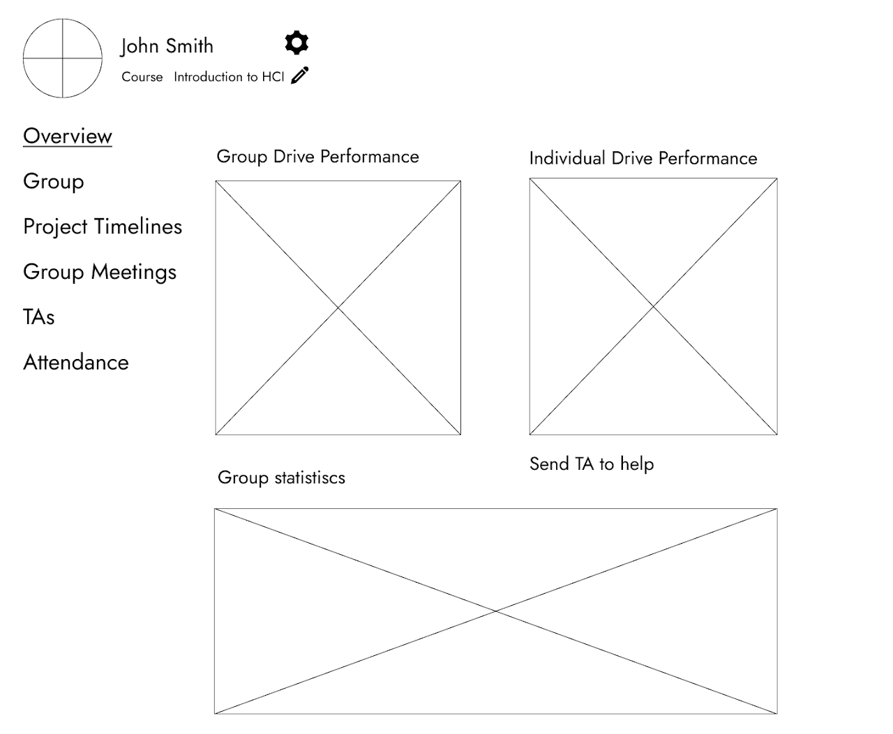

## Student's Wire Frames

### Group Information Page

This page shows the statistics of a group broken down by Google Drive contribution over time (top left), drive contribution broken-down by group members (top-right) as well as attendance and general info (emails, names, etc) at the bottom. 

After explaining each section, the client could see the value in it. However, we had to explicitly state our left-to-right logic of group to individual contribution. After this however, the could see the benefit of knowing whether or not the group was working before checking to see if individuals were.

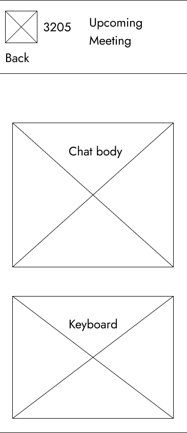

Basic chat interface for students. Of note however, is the students group name and icon in the top left versus the traditional center as well as an area to let the student know when the next upcoming meeting is.

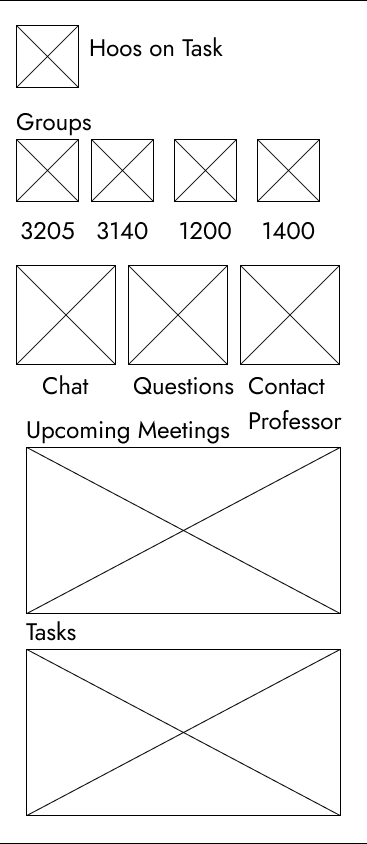

*Hoos On Task* homepage. The top shows the logo and the name. Below that are the groups each student are in as well as the icons to represent them. These icons are filters and clicking them will filter the tasks and upcoming meetings to be group-specific. 


*Hoos On Task* Tasks bar. This page mirrors the chat layout and the group's name is displayed on the top-right of the page.

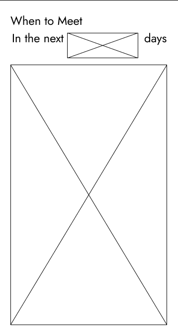

Meeting scheduling in-chat widget. A primary box below is a calendar view which allows the user to select the times that they are available in the week. At the top, however, is a widget which allows the student to specify what time frame the called meeting will be in. This is important because, filling out a when to meet for the entire week is inefficient if the groups wants to meet in the next 3 days, for example.

## UX Targets

When discussing our project, we identified the professor's user experience to be far more influential as to the success and implementation of *Hoos On Task*. For this reason, key onboarding tasks such as the Ease of Importing, Ease of Reuse, Group Moderation and Task Assignment need to be both quick and painless from the perspective of the users.

For the students, a key point is early introduction to the distinguishing features of *Hoos On Task*. This is due to the heavy competition with other communication apps such as iMessage and GroupMe. 

For metrics, average time on task was used primarily. The goal of this project is to augment the existing process of group work. Therefore, our group felt that the increase in speed was the best way to measure the value of this project. Though other metrics such as the number of mistakes would have been also valid choices. Average time on task bakes in the time wasted from mistakes into a more comprehensive metric for success. 

### UX Targets Used:

**Initial performance** - how quickly is the professor able to import there work or roster from a spreadsheet into our interface
**Recurrent Performance** - For multiple different classes across semesters, professor should be easily able to recreate assignments and group work
**Learnability** - For first time users, both professor and student, they should be able to quickly understand how the app works and being organizing their group work through it
**Advanced Feature use** - within the app, the individual features should aid in organization. While there are multiple features, they should not take away from the simplicity and ease of use of the app
**Understandability** - each individual feature must not be too complex that they are different to comprehend.  As for the professor metrics, they should be able to quickly identify group participation and whether or not they will need to meet with a group regarding this
**Long Term performance** - The interface should be enjoyable enough that students continue to use it outside of their typical class time. 

This table is the preliminary UX Target Table that will be expanded upon in the next phase. 

[](https://drive.google.com/open?authuser=0&id=1z7RZ4mcSA_Rr9GSWmZcVIiYOXEecQBDzktzDCA3-cns "Open Spreadsheet, UX Target Tables Notes (KPIs basically) in new window")

UX Target Tables Notes (KPIs basically)

### Work Artifacts Throughout the Design Process

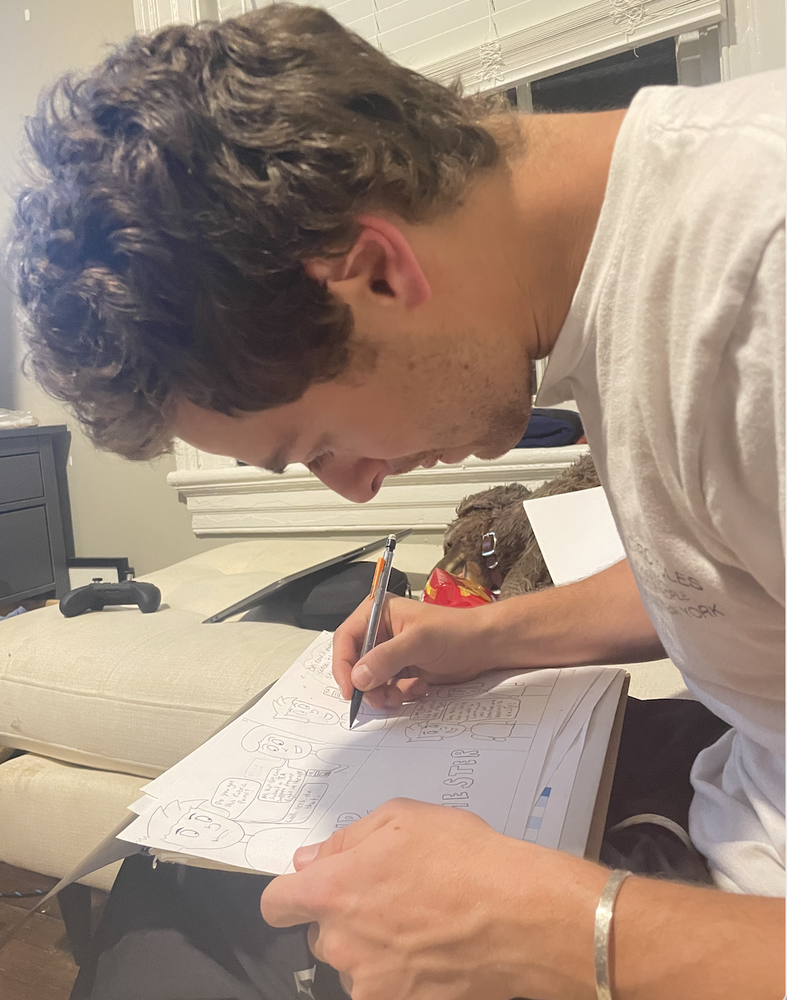

> John creating storyboards

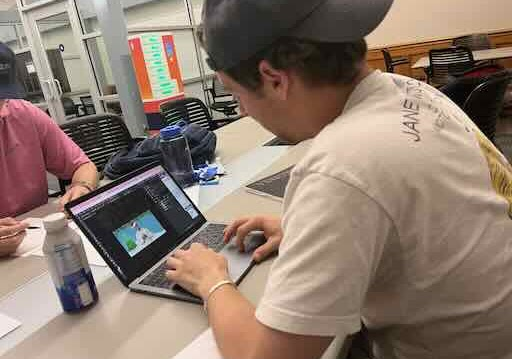

> John making Gerald Froople sticky 

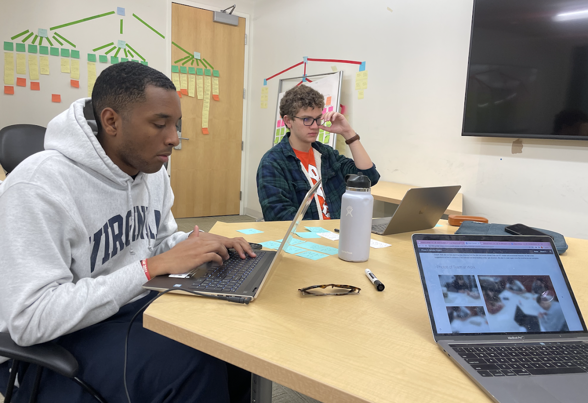

> Group working on Mental Model

<!-- 

> Text conversation scheduling a meeting with our client to review our initial sketches  -->

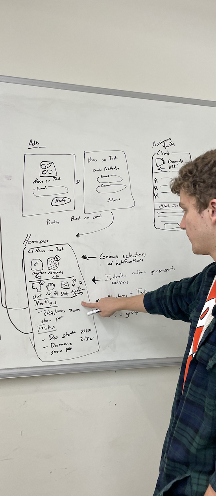

> William working on basic app sketches