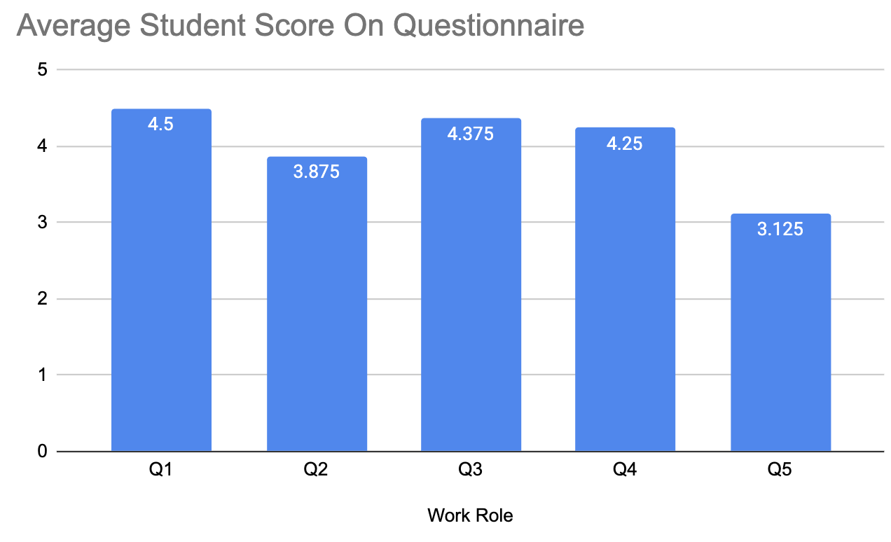

### Target Table Process, Rationale and Description

When deriving our target table, we decided to focus on our two primary users, students tasked with using *Hoos On Task* for group work, and instructors who are assigning group work to be done using *Hoos On Task*. When determining the baseline and target levels, we took into account the skills/ experiences of the typical college student and their ability to use apps. That is to say we estimate that the average college student is relatively proficient at using apps. For professors however, this may not be the case. Though we recognize a professor who is likely to use a service like ours is most likely enthusiastic about and proficient with web technologies, we understand that many professors are poor with technology. While these individuals are not likely candidates for our service, we thought it would be nonetheless hard on average for a professor to navigate the pages and user services etc. and adjust the baseline and target levels accordingly. 

From the textbook, we understand that benchmark tasks should have large coverage of the apps services and should focus primarily on places we think there could be issues or services used frequently by users. That was the basis behind our benchmarks. We can break them up into two categories, those related to the functioning of the app and its key features, and others related to user experience and overall satisfaction with the app's function as well as aesthetics. 

For students, we wanted to make sure the main features of task and meeting setting function properly. For professors ,we want to make sure group organization and student data analysis is seamlessly integrated. The BTs are aimed at targeting the use of the most popular features while the questions gauge the emotional and practical response to the app. We want to make sure the service is a benefit to users and that there are no disconnects between their user experience and the app’s capabilities. 

The questions are aimed at gauging user satisfaction with the service. Whether this be with the attractiveness of the app/app aesthetic or if it has to do with an organizational issue with the flow of the app. These questions and the corresponding responses help to clarify whether the current prototype satisfies these needs.

## Final Target Table

## Concept Statement

*Hoos On Task* should help UVA students and professors work effectively and cohesively in a variety of group activities. It provides students with a platform to communicate, check group and instructor deadlines, record group attendance, and give a forum to communicate with TAs along the timeline of a group project. It will be an instructor’s platform to monitor group activity and gain a heightened understanding of group interaction and commitment. By Informing instructors of the time, duration, and attendance of group meetings, while also being able to parse group meeting notes, the instructor can actively monitor how often groups are meeting and who is attending. Instructors will also be given an interface for answering student issue reports while also being able to easily issue announcements and deadlines. *Hoos On Task* is a simple, streamlined service that relieves the stress of group work by allowing greater ease of communication and consolidation of relevant information.

## Design Refinement

### Process

Our refinement process was a culmination of advice given from our client, our TAs, and interviewees who shared their own insights into improving our design.  All of the individuals we spoke with gave us advice on how to update our interface both technically and aesthetically.  

All of our group members carefully compiled notes on this subject and used these together to target the larger issues in our design and iterated through our previous work to improve it based on calculated decisions.

The way these discussions were structured, we first ran through our design idea, implementation and prototype in order to refresh the memory of the client, and also explain these ideas to people who have not yet seen our interface.  After this, we gave them the floor by asking for general feedback on any aspect of our design.  Most of the feedback we received was aesthetic in the sense that it focused on strengthening our design through the layout of our interface and certain features to enhance our design.  However, we also received feedback on different structures within our app that could be implemented to enhance the ease-of-use as well as the recognition between our app and other interfaces commonly used by students and professors. 

### Client Recommendations 

When speaking with our client,  she emphasized that our interface must remain simple.  She stressed the importance of ensuring that our app had a structure that was similar to other apps, so that when the user interacts with the app, the time of learnability will be quick.  In order to fulfill this, she said that we should have a symbol for each page that is recognized across all apps.  For example, on our messages tab, she recommended including a text bubble symbol, for our project schedule tab, a calendar picture, for our group meetings, a picture of emoji people, our TA questions, a question mark, and finally for attendance, a schedule picture.  This was highly beneficial to us because it helped us recognize that the inclusive of this would not only benefit the overall usability, but also shorten the learnability time because the app would feel familiar

As for aesthetics, she liked the overall layout of our project.  She enjoyed how our tabs were clicked to access them, and also how all information was clearly displayed large enough and simple enough so that there would be no confusion on either the student or professor front.  She did recommend that in our project schedule tab, that we should have the completed deadline be highlighted green instead of yellow, in order to clearly show that that task was finished.  We liked this idea because it would boost the cognitive affordance of the user, by highlighting that their deadline was completed and promoting a sense of reward when it is finished.

### TAs/Interviewee Feedback

A lot of our feedback from the TAs came from our meeting with them during the Checkpoint 4A.  Similar to the client meeting, we discussed our idea and asked for open feedback on what we should change or alter.  One of the biggest takeaways from the discussion from the TAs is that in the TA feedback page, they suggested implementing a system where instead of just having a space for individual users to communicate with the TA, there would also be a space where all questions asked by the group would be recorded.  That way, the user would not have to ask a repeated question and the TA/instructor would not be overwhelmed with questions, thus boosting the ease-of-use of the system. 

For our interviewees, they provided us with more aesthetic modifications.  For instance, they said that we should clearly display our logo, to distinguish our app from others. We liked this advice because it created uniqueness for our interface, and also clearly displayed to the user our originality.

Both groups, however, did suggest that we should have our tabs located at the bottom of the page.  The idea would be that when the app is opened, it is opened on the main page of our choosing,for example, the group messaging page.  Then, the buttons for the other tabs would be located on the bottom of the page, similar to apps like instagram, snapchat or twitter.  The user would then be able to swipe to or tap on any of the tabs to access that page.  This modification would provide increased similarity and make it easier for the user to understand, learn and navigate our system

### Comments from Checkpoint 4a

Something that we as a group learned from the comments from the checkpoint was that the UX target table alone is not sufficient to explain testing methodologies.

We initially had metrics such as "Amount of time needed to understand information" where the professor would be put into a scenario of identifying under performing groups and group members in the course. This additional context was not present in through the information in the table, however and additional context would be helpful in explaining the benchmark metric.
 
## Prototyping

To begin our prototype process, we thought of different ways to make our product accessible to both students and professors.  After considering different digital interfaces, we decided that the best way to create a prototype for our interface would be through an app, accessible both on mobile devices and websites. We chose this because we felt that while students would mostly access our features on their phones, professors would more likely than not want to access these features on their PC or desktop computer.

### Coverage

We were deciding between T prototypes and local prototypes, but eventually chose to model our system after a **T prototype**.  The reason for this is that we felt the T prototype would allow us to have more depth in depicting our system to the user, as well as increase our understanding of the system.  In the T prototype model, we analyzed every aspect of our interface, ranging from the number of interactions per tab to the color of different task bubbles.  From this we used our knowledge of similar systems, as well as the advice given to us by the TAs, client, and interviewees to modify our design.   Additionally, our prototype is a T prototype because we developed it in the sense of that it covered a full breath of system functionality and we designed the depth of certain features, such as our home page, so that it could be used in the interview process to analyze our **benchmarks tasks**.  Specifically, on onboarding is what carries significant depth because it is associated with an already used system, emails.

### Fidelity of our Prototype

When deciding the fidelity of our prototype, we understood that focusing our attention on the overall functionality and completeness of the prototype was of paramount importance and through iteration we could focus on secondary (but still important) concern such as aesthetics.  Our reasoning behind this is because we believe that group work is a task that requires a lot of interaction.  There is constant communication between members, participation is a must and there is significant Collaboration with TAs and the instructor.  With a high fidelity prototype, the user will be able to properly envious themselves using our interface, thus prompting them to give us clearer feedback on what needs to be improved.  If we kept our prototype low fidelity it would be more difficult for the user to properly critique it, and it would be more difficult for us to refine it based on the users’ input.

### Interaction

As for the interactivity within our interface, we chose to divide it into two sections, the student user and the professor users.  By doing this, we highlight several interactive features within our system, and the way that the user will be able to carry out these interactions.  This allows us to contextualize our prototype and ensure that we stay on track during the prototyping phase. 

**Student Side:**

The main goal of the student's interaction prototype is examining the viability of an email-based authentication flow. A key factor in the usability and stickiness of *Hoos On Task* is that professors are the decision makers in getting students as user.

This provides a distinct competitive advantage because from that point the user simply needs to be activated by conveying the value of the product through on-boarded modals and then getting the first few messages sent through the interface.

- The user will be able to input other information such as hometown, interests/hobbies, and a bio if they are inclined.
 
- A series buttons that navigate between the tasks of Group Messenger, Project Schedule, Group Meetings and Group Attendance
 
- **Group Messenger** -  the user will be able text each member of their group both collectively and individually in order to discuss their projects.  The user will have the ability to select all or specific group members to message, and the chats will be logged so that each member can view them at a later time.  The messenger will also provide the ability to post pictures, videos, charts, or any other information that they might need for their communications and project.
 
- **Project Schedule** - shows the user a list of deadlines and reminders, where under each deadline the user can have a summary of the task and “check off” the reminder when it is completed, similar to the reminder app on IOS
 
- **Group Meetings** - allows the user to select meeting times, and lets the user select an RSVP option where they confirm their availability and/or if they can come to the meeting.  The tab will then display the confirmed date of the meeting and create a label for this date in the group attendance tab. 
 
- **Group Attendance** - this tab will have a list of the group members which attended the meetings.  The user will be able to post notes from the meeting under a label representing the date that the meeting was held. All group members, but specifically absent members, will be able to view these notes and add to them so they are not left behind.
 

### Professor's Side

The professor's interaction prototype has two main goals: creation and moderation. The primary task is for the professor to create a new class and then identify the under-performing group members of this class after some time has passed.

- The instructor will be able to make an account similar to the student, using their UVA credentials
 
- They will have the option to create a teacher’s profile, which will have their name, the department they teach in and classes they currently teach
 
- They will also have the option to create a bio personalized with their hometown, hobbies, interests, etc.
 
- After account creation, the application will take them to a page where they can select “Create Class Project”.  The instructor will have the ability to link the class project with the instructions they may have previously written in a word or google document.  They can also create the project instructions directly on the app through an interface that allows them to type out instructions
 
- Instructors will then have the ability to add the class roster directly to the app through SIS, and excel spreadsheet or manual entry. 
 
- The instructor will then select a page titled “Group Creation” where from the roster, they will click and drag the names of the students into a group where the number of members is of their choosing.  There will also be a randomization option, where the instructor will select how many students they want per group, and the app will randomly place the students’ names into the groups.
 
- Once the groups are formed, the instructor will be able to oversee group contributions, message groups or specific members(similar to the group messaging tab) and track attendance.  This will be under a tab titled “Monitoring”.
 
- Under a “Data” tab, the instructor will be able to select individual groups, then view statistical data about attendance, number of tasks completed and the timeliness of these completions, and comments from the group.
 
## Process

When we began crafting our prototype, we chose Figma to display our interface.  Figma felt like the best choice for us because it accurately depicts the functionality of an app, and would allow the user to interact with our interface. Although Figma can struggle with textual user input, we still felt this was the best option for our team. Many of the shortcomings of Figma were able to be mitigated through careful interaction design (particularly around uploading classes / chat functionality). Furthermore, many members of our team had preexisting experience with Figma, so our team felt that it would be best to avoid newer, less certain software.

Our next step was determining the layout of our app.  We wanted to create a homepage that when the user opened the app, it is initially greeted with that page.  We chose to use the deadline page as our home page because we felt that showing the user the most pressing matters first would enhance its ease of access for the user.  Next we created a page where each tab could be accessed.  We did this by having a display with the name of each task, and then allowing the user to click on the button of their choosing to display the next tab.  

As for the professor side of the prototype, we also used figma but this time had the professor page displayed on a website.  This allows for increased usability, since most professors will be monitoring groups during their working hours, at a desktop.  The professor page has a similar setup to the student page, where they can click on a series of buttons to bring them to the next tab.  What makes it different is that the professor page also has access to group metrics.  This was a feature we wanted to include in order to capture the essence of our interface.  The metrics are presented to the professor on the screen, where they are able to click and expand different charts, graphs, etc, that display participation and Collaboration levels among groups.  

Aesthetically, we discussed ways to make our interface pleasing to the user.  We took the advice from our client, and decided on a simple yet sleek design for our app.  We wanted to ensure that every tab and its function was clear, and that there were no overcomplication or hidden features.  The way we achieved this was by making our prototype have labels that highlighted the interactions presented on each tab.  For example, on the messages tab, we include a feature similar to a typical messaging app such as *iMessage*, *Facebook messenger* or *Instagram*, where there is a log of the chats sent by the user, and a keyboard for them to type.  Also, we ensured that certain features like a keyboard, or a number pad, were not present unnecessarily, in order to have constraints for the user. 

In conclusion, the prototyping phase was insightful and instrumental in the furtherance of our final product. The prototyping steps and new inclusion into our system are highlighted below through a series of images and videos which walk through our interface and some of the modifications we made.

### Student Wire Frame

A key element of the student airframe is account creation by the professor. For this reason, the students interaction design begins with receiving their email. 

<iframe jsname="L5Fo6c" sandbox="allow-scripts allow-popups allow-forms allow-same-origin allow-popups-to-escape-sandbox allow-downloads allow-modals" frameborder="0" aria-label="YouTube Video, *Hoos On Task* - Student Demo" src="https://www.youtube.com/embed/fT_l7dpvLhg" allowfullscreen=""></iframe>

> Note: Google Sites and Figma previews integration can often lead to unintended outcomes. Clicking to open the Figma in a separate window is best. Furthermore, pressing the z key will scale the Figma to your device's resolution for a better viewing experience.

First iteration of student airframe

Carousel image of our newly implemented home screen 

<!--  -->

> Final Home screen after changes were made from client discussion 

### Professor Wire Frame

As a group, our goal was to have the professor demonstration focus on group creation, moderation and assistance. Unlike the student experience, we were not as focused on the on-boarding experience for the professor. For this reason, our demonstration begins with a scenario

<iframe jsname="L5Fo6c" sandbox="allow-scripts allow-popups allow-forms allow-same-origin allow-popups-to-escape-sandbox allow-downloads allow-modals" frameborder="0" aria-label="YouTube Video, *Hoos On Task* - Professor Demo" src="https://www.youtube.com/embed/kjY1BLHSZow?fs=0" allowfullscreen=""></iframe>

> Note: Google Sites and Figma previews integration can often lead to unintended outcomes. Clicking to open the Figma in a separate window is best. Furthermore, pressing the z key will scale the Figma to your device's resolution for a better viewing experience.

The slides for the final version of the professor's view can be observed below. From this view, common design styles can be observed. In particular, the "group" design system element which can be seen in the group activity moderating page, importing classes by individual name and overview of all present groups from the professor's perspective.

## Evaluation

## Relation to Target Table

Our evaluation of our prototypes was drawn directly from our target table. It is what we used to derive the tests that our interviewees completed to demonstrate the effectiveness of our design. The tasks were designed to demonstrate ease of use and ensure that the app is easily navigable. It has a somewhat limited scope which plays to our advantage in a navigation sense. This means the app has to be streamlined and highly effective at the services it offers. We are using surveys as a way of gauging not only the efficiency of our app, but the user reaction and sentiments pertaining to the app as a whole. By this we mean that it is aesthetically pleasing, that the services it offers actually benefit users, and that there are no pain points in the app's usage that could cause a user to be discouraged from utilizing the app. Though the app functions very differently for professors as opposed to students, the same premise of strong usability and learnability are consistent across both user classes.

## Goals of Our Study

The goal of our empirical evaluation is simple. To determine whether or not we have developed a comprehensive system which i)  gives benefit to the intended user ii) integrates seamlessly and easily into a group work environment. If we can deduce that the app is easily navigable and that overall user satisfaction is high, then we can assume the prototype has a good foundation. However, it does not stop here. Beyond these goals through the iteration process we hope to further refine our prototype until it meets our goals but also is sleek, professional, and most of all helpful. These are the goals of the general UX process, but in this step we saw many iterations and changes be made to our prototype to improve its usability and overall design. These helped us form the foundation of our experimental design. We thought it would be most effective to have users perform benchmark tasks while collecting relevant metrics to understand our apps usability, understandability, and learnability. We then decided a questionnaire could be utilized to gauge overall satisfaction and emotional impact of our service.

## Benchmark Tasks

Our group met and spent a period of time individually developing our own potential benchmark tasks. We were trying to find actions that a typical user would frequently use and could be easy to measure in an evaluative setting. Obviously certain aspects of the app worth testing are impossible given the power of the prototype (like testing an instructor’s ability to input a class roster as an excel file), we chose to focus on activities that were pivotal to the key features of both user classes and could be easily demonstrated. The first task is a routine navigation to a given page, in the instance of the student, it is the “deadlines” tab. This is a mere demonstration of the ease with which a user can navigate the home page and without use of consistency in the logo representation of certain pages, we estimate this will not be an issue. The next two biggest tasks we feel the students can do with the app are assigning deadlines and creating group meetings. After we have established that an individual can easily navigate between tabs it is essential to make sure that these two functions work as intended as they are a key way in which the app allows individuals to effectively communicate with their group. Obviously other features such as the QR attendance feature is something that would be useful to test, but again, our prototype doesn’t have the strength for us to test that particular feature.

### Instruments

- Stopwatch (used iphone stopwatch)
- Questionnaires
- Computer (for zoom and for viewing prototype)
- Notepad (for noting observations)

### Student Questions

- **Q1: (From 1-5)** How easy is it to find your desired tab?
- **Q2: (From 1-5)** How satisfied were you with the general layout?
- **Q3: (From 1-5)** How comprehensive is the app? Is it lacking functionality for the task?
- **Q4: (From 1-5)** How well does *Hoos On Task* condense relevant project information?
- **Q5: (From 1-5)** Would you react positively to being assigned a project that used *Hoos On Task*?
 

We decided to have the first set of questions be different for our different user classes as the site/app functions very differently for both groups. These questions, for the students, were chosen to make sure the general layout and functionality of the prototype is acceptable for users. Questions 1 and 2 are targeted at explaining the usability of our platform. Question 3 is oriented at ensuring the desirability of the app; making sure the entire scope of the user’s needs are met and so are our UX targets. Question 4 is focused on organization and understandability. Question 5 is gauging user satisfaction in the context of the app’s designated purpose. 

### Instructor Questions

- **Q1: (From 1-5)** How easy is it to find your desired tab and parse through student data?
- **Q2: (From 1-5)** How satisfied were you with the general layout?
- **Q3: (From 1-5)** How comprehensive is the app? Is it lacking functionality for the task?
- **Q4: (From 1-5)** How relevant do you think the student data *Hoos On Task*s offers is for assessing individual participation? 
- **Q5: (From 1-5)** How likely would you be to use a fully functional *Hoos On Task* to assign group work?
 
Questions 1-2 are based around gauging usability and learnability as it pertains to the instructors. Question 3 is oriented at ensuring the desirability of the app; making sure the entire scope of the user’s needs are met and so are our UX targets. Question 4 relates to gauging user satisfaction as it pertains to the data gathered and displayed to instructors. This is a vital function of the app so it is important that this data be relevant to instructors. Question 5 is aimed at assessing the how easily implementable of the app from an instructor perspective which allows use to gauge how easily 

### General Questions (Students and Instructors)

- **Q1: (From 1-5)** How satisfied were you with the overall *Hoos On Task* experience?
- **Q2: (From 1-5)** How would you rank the overall design/aesthetic of the app?
- **Q3: (From 1-5)** How would you rank the overall emotional experience of using the app?
- **Q4: (From 1-5)** How much do you think this app would actually improve your group work experience?
- **Q5: (From 1-5)** How enjoyable was your experience using *Hoos On Task*?
- **Q6: (Open Response)** Were there any features of the app that you found confusing and if so why?
 
These questions are all gauged at understanding the underlying emotional impact of the service. We are attempting to make sure, from an emotional perspective, that the app is enjoyable to use and has high aesthetics. The free response gives us insight into what were sticky features/problems with the app. If we find a commonality among these, there is a clear issue that needs to be fixed and is not user specific.

- We found participants by asking our friends and professors who fit the criteria of our user classes
 

### Student User - college student, first-time user (8)

- Alex Brancato
- Austin Campbell
- Quinn Kingwill
- Alex Shen
- Emily Kienzle
- Claire Kraemer
- Anne Brown
- Kemp White

### Instructor - college professor assigning a group project, first-time user (4)

- Professor Sunya 
- Professor McGee
- Professor Sampson
- Professor Moore 

> Note: We wanted to interview more professors, but given the time and availability around finals this was increasingly difficult. We were able to get four but recognize this may be a shortcoming in our data collection

## Interview Procedure

- The textbook told us to not be so specific with how we present information to participants so when we begin our discussions we simply tell them, “you are a participant in the evaluation of an app that would be used to assist in class group work called *Hoos On Task* which condenses message and project information into one app.” 
 
- The team member sequentially goes through the tasks briefly but concisely explaining what is expected of the participants and answers any questions posed by the individual. 
 
 - When asked to fill to interact with an element that wast fully function (like a text box) they are told clicking on it then clicking the corresponding activity button (like send) was sufficient for showing task completion. This is done for consistency in the UX metrics
 
- Team members say “start” after the conclusion of the explanation and at the same time they would start the timer.
 
-  Once the participant completes the task the team member stops the timer and records their time. 
 
- The participant goes back to the home screen and the process begins again for the next task
 
- After all tasks are completed the participants are sent the links to two surveys, the general survey and the user class specific survey. 
 
- The user completes the survey and the team member gives no input. 
 
### Intervention Procedure

- During tasks participants should be encouraged to problem solve on their own, but If a participant is stuck on a task for more than 10 second prompt them to think aloud
 
 - By 20 seconds longer than expected they should be asked to explicitly describe the issue. 
 
 - If this occurs, determine whether their inability to complete the task is because of an error in the prototype or because of an ambiguity in the design and record information about it.
 

### Apparatus

We used Figma to build our prototype. We understand it is not the most ideal choice in the eyes of our instructors in this class, but group members have had experience with it in the past. It was very helpful in building an interactive model equipped with the capabilities we needed for the sake of the evaluation. 

Meetings took place in various buildings on grounds including libraries and classrooms, as well as in apartments, and in one instance, on Zoom.

### Method For Data Gathering

- We used a timer to record user times on the given task. The timer was started in accordance with procedure, commenced with a "start" after the task explanation
 
- Errors were recorded by observing the user interacting with the site on each task and were further discussed to see if it was actually an error.
 
- Questionnaire data was collected by sending the users a link to each questionnaire and having them complete them on their own, without input from our group mates. This data was put into Google Sheets for analyzing and making graphs.

## Results

### Observations
 
- Students were confused by what it meant by tracking and had various ideas about what exactly that meant
 
- Students often had some hesitation about professors judging them for their work habits (procrastination)
 
- Students were not immediately sure if when sending a question to the teaching staff, the question could be sent on behalf of them individually
 
- Some students were occasionally confused by the "@+keyword" system for assigning tasks or scheduling meetings in the chat
 
- Students were confused by the suggested similar questions on the new question page
 
- Professors often looked to the side bars to send someone to help another student
 
- Professors were concerned with how in larger classes, scrolling through a list of students to manually find a specific one would take a very long time
 
- Deadline management was confusing and not immediately obvious that the deadlines were synced between Learning Management 
 

### Student Task Data

### Professor Task Data

## Summary Graphs Derived From Data

Though the user classes have completely different interfaces, we decided that tasks 1 and 2 were defining essentially equivalent tasks which is why we decided to graph them together.  Task 

Task 1 is the amount of time it takes to navigate to a specific tab. 

Task 2 is the amount of time it takes to assign a role or deadline within a group or to a specific group

## Questionnaire Data

## Questionnaire Graphics 

- **Q1** - How satisfied were you with your overall *Hoos On Task* experience?
- **Q2** - How would you rank the overall design / aesthetic of the app?
- **Q3** - How much do you think this app would actually improve your group work experience?
- **Q4** - How much do you think this app would actually improve your group work experience?
- **Q5** - How enjoyable was your experience using *Hoos On Task*?

 

### Target Table Updated With Results

## Experimental Design Process

Our experimental design was a direct product of our target table. The benchmark tasks we developed and the according metrics we decided to measure them with became the basis behind out time to task tests. The tasks we picked were already described above but we further discussed how we would standardize the measurement of the tasks to ensure constancy across interviews. Participants will be given our Figma and that will be the basis for the tasks and after will receive the questionnaire which will be sent after fulfilling the tasks. We all Collaborated to develop the procedure laid out previously in our evaluation section and then began deciding which questions would be relevant for the questionnaire. We all brainstormed our own list of questions and compared them to get our final list. We realized we needed two different questionnaires for the two user classes as their interfaces were so different. This then became the basis for the specific questionnaire. The rationale behind those questions is included in the evaluation. For the general questionnaire, our goals were gauging user satisfaction, general thought on aesthetic and design, general layout concerns, and lastly emotional impact. We decided using a *Likert scale* in the questionnaire would be an effective way of quantifying these questions for analysis and evaluation. 

## Findings and Change Reporting

### Findings & Changes to the Student Interface

Students generally reacted very positively to *Hoos On Task* in the questionnaire. This makes sense due to how frustrating an inequitable share of group work can be for those contributing more, or sometimes all. It is also worth recognizing the inherent bias that many of our interviewed students may have had. Knowing that they were being interviewed for a class project, it is possible students responded more favorably in an effort to make our project seem more successful. On the other hand, in contrast to instructors, students on average had easier experiences navigating and using the app. Ease of use goes a long way in user satisfaction. While the results may be slightly biased, we hope the overall incredible student satisfaction with *Hoos On Task* is mainly due to the quality of the app. 

Moving on to specific student interaction and interviews, a common concern for this app was privacy. A general level of skepticism surrounded the idea of having professors being able to monitor groups. There was a vagueness to monitoring which students were concerned about. Furthermore, the students mentioned that the professor would become critical of their work patterns (ie. if they worked late at night). It makes sense to us that this disparity in care for privacy is in close correlation to how much those students are accustomed to contributing in normal group work. It is worth noting that, although the groups of those with and without privacy corners can be delineated somewhat by group work contribution, our design was not without fault. 

Adding more redundant information helps with navigation as professors found not being able to have all options available through the surface level annoying. This represented a tradeoff between simplicity for more experienced users for learnability for more advanced

For the next revision, in the onboarding models, we plan to show a stripped-down professor view to the student which shows that by drive and communication activity, people who are not contributing are shown. A point which is stressed is that an emphasis is placed on large differences (proportional contribution versus zero contribution). Even further, the model will emphasize that group data is only used as a basis for discussions about contribution. This should ease students wary of privacy issues, while still allowing the overhead scrutiny *Hoos On Task* has been designed to facilitate. 

Students liked the ability to ask questions in an integrated way. However, when looking at the interface, whether or not they were asking a question directly to the professor (ie. a personal question) or asking a question on behalf of their group was not immediately known. In the next iteration of the design, a toggle switch will be present in order to communicate this information.

Onboarding model explaining to users the texting commands using the @ syntax

No students had any issues navigating to specific pages, which shows promise on our app’s navigational system. On the other hand, two students had trouble successfully creating a group task, and one had trouble at first assigning a group meeting. Our current system of using “@” and keywords within the group chat to assign tasks or create meetings was clear to only some students. This keyword system is very common in social platforms such as Discord, and upon further questioning both students confused by this “@” assignment system had never used that social platform before. Once students were instructed on the proper use of keywords, they understood and thought it was a good system. Our thought is that instead of changing the system, this issue could be easily resolved by having the chat help page available both from login (as is currently implemented pictured above), and later as a “help” button within the chat page. This is in fact a suggestion from one of the interviewed students who had trouble at first. 

The New Question page, showing the list of suggested similar questions

Another issue that a student had was with navigating the Questions menu, specifically with creating a new question. Almost every student interviewed, when asked to create a new question about a certain topic, looked first at previously asked questions to see if they were asking something redundant. The student error in Student Task 3 came from a student who, after unsuccessfully querying for similar questions, successfully navigated to the “Submit Question” page. Upon getting to this page, the student clicked on one of the similar questions, and became lost with navigation. The student later reflected and said they think this similar questions page is redundant. As most other students did when navigating, this student suggested that most people will look for similar questions before asking a new one so as to not annoy a professor/TA. This student thought that a similar questions list within the new question page is unnecessary because students will have already searched for relevant questions beforehand. To them, all the similar questions list did for them was confuse them. 

### Findings & Changes to the Professor Interface

In general, our group noticed that professors sought redundant information. Given the unknown problem, erroring on the side of too many access points for things like: learning management integrations and communication was better. Given the diverse background of prior systems used to manage group work, additional modes of access makes it far more likely that an affordance will be present in similar interaction design with their current work practice. Thus, this was deemed not  a significant problem. 

Professors similarly with students had an easy time with the basic navigation of the website, and were generally complimentary of its organization. On the other hand, instructors did have more difficulty than students with the more complex tasks required within the website. There was only a 50% success rate of professors initially being able to successfully create a deadline. Two professors later expressed confusion at why they would need to assign a deadline on *Hoos On Task* when it would already be available elsewhere on learning management systems such as Collab or  Canvas. Ideally, a perfect solution to this problem would be to further link *Hoos On Task* with the instructor's choice of LMS (learning management system), such that when assignments are created there, their deadlines also become posted and available for students within the *Hoos On Task* site. 

Adding the Google Drive information to each page to make connecting an seeing a groups work more available. This tabular design for displaying group information places heavy emphasis on visibility and understandability of exactly what is going on in each system (shown through the amount of data being displayed). Furthermore, using red, green and yellow for bag, good and moderate shows consistency with other systems.

One professor also had an error trying to navigate to a specific student’s statistics page. Luckily, the instructor was able to quickly resolve this error in a few seconds, and hopefully this error can be attributed more as a “miss-click” rather than a significant issue with the *Hoos On Task* system. Instructor 3 suggested that, in much larger classes, finding a specific student would be very difficult. They also stressed that since *Hoos On Task* is designed around creating accountability for group work in large classes where individual accountability previously wasn’t possible, creating a solution to this potential problem is necessary. 

On a group's information page, the micro-interaction of being able to assign someone to help a group with a custom note was noted to be clever. However, we came across another potential change when professors expressed their desire to also have a redundant link in the sidebar of the application for this feature. This change represents making a conscious decision between simplicity and learnability for this software.

Finally, when importing students, one thing that had not been considered was the complexity of students dropping courses. Professors expressed that the start of coursework can be stressful because students dropping can lead to teams having to be rebalanced which can induce unnecessary complexity for professors. For this reason, importing directly from LMS (rather than the initial connection to LMS) was a top-priority feature for professors.

Changes
<!-- 

 -->

## 1st prototype home screen

Changes from our initial homepage to our final home page stemmed from our discussion with our client and TA.  Both suggested that a centralized homepage with images representing the tabs was easier to understand and more aesthetically pleasing than a bland screen with the names of the tabs. Additionally we added increased functionality by relaying meeting and task information on the homepage. We improved understandability by making meeting and task bubble colors correlate to due date (i.e. turning red when a due date is approaching)

## Final prototype home screen

## Work Roles

- **Project manager:** - Will Kaiser - Responsible for managing and organizing the team to get the project done. This person should organize meetings, take notes, make sure action items and tasks are clear, and make sure other team members are getting their jobs done.
- **Research lead:** - John Parzick - Takes primary responsibility for the research/analysis portion of the work.
- **Design lead:** - Hunter McGuire - Takes primary responsibility for the design portion of the work.
- **Prototyping lead:** - Caleb Adam -  Takes primary responsibility for producing the rapid prototype.
- **Evaluation lead:**  - Distributed Evenly - Takes primary responsibility for evaluating the design.
- **Reporting lead:**  - Distributed Evenly - Takes primary responsibility for putting together the project report. This is a wild card role, which means it would be a secondary role that should be picked up by each member during each one of the five project phases.